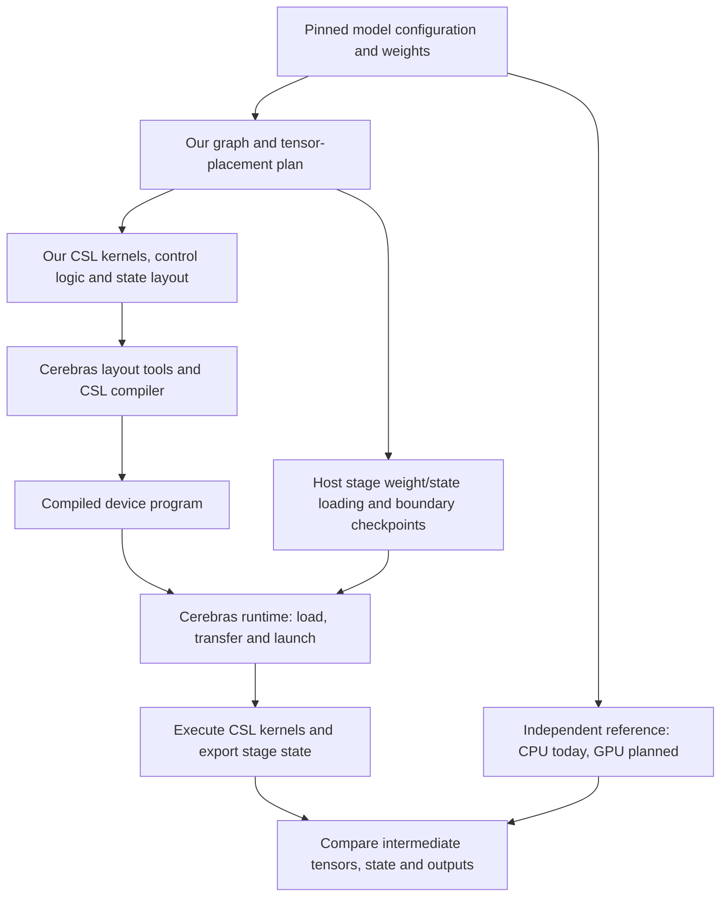
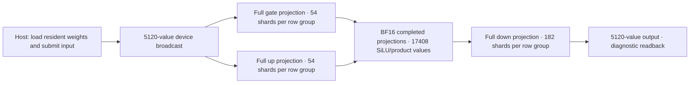

# CSL-LLM SDK

**Building inference for open language models with handwritten Cerebras Systems Language (CSL), targeting sequential execution of three model stages on WSE-3.** We implement the numerical kernels, execution control and persistent model state, and use the Cerebras SDK to compile and run the device programs. The first target is **Qwen3.8-27B text inference**; the longer-term goal is a reusable SDK for related model architectures.

**Latest accepted milestone:** complete original Layer0 compiles in a vertical
30×1160 region with a top packet spine and west-to-east boundaries. Actual
1508 application programs,34800 PEs and401469 banks pass the scoped static
resource checks; maximum ordinary SRAM plus4096-byte reserve leaves304 bytes.
The top layout corrects the first vertical packet-hop regression. Physical
Layer0 numerical execution remains open. Its first physical attempt reached the
240-second startup limit before model H2D or neural capture; the owned job was
cancelled and resource release independently verified. See the
[report](docs/LAYER0-VERTICAL-TOP.md).

**Working today:** the complete original-weight Layer3 attention/MLP graph
executes causal positions 0 and 1, then device reset and exact position-0 replay
on physical WSE-3. All three captures pass the conditional operator gates and
independent transport, state, parameter and release checks. The device client
exits normally; the original outer supervisor exit 1 and missing COMPLETE are
preserved, and a separate postcapture audit passes. The earlier full MLP covers
four inputs; a separate 64-layer CPU reference generates four tokens with cache
restoration.

**Numerical scope:** Layer3 conditional operator gates and independent FMA
samples pass. Nominal CPU BF16 mismatches are 346/1,150/346 of 5,120 across the
three serials, with maximum absolute differences 0.00390625/0.001953125/0.00390625.
Bitwise CPU parity and a source-propagated whole-layer enclosure are not established.

**Current work:** validate original Layer0 positions0/1/reset/0 on the top-spine
artifact, then actual0→1→2→3 hidden flow and all64 layers across three sequential
stages on one physical CS3 with full host checkpoint restoration. The accepted
Layer3 scope remains its finite0→1→reset→0 sequence. Full-vocabulary logits,
CSL text generation and matched end-to-end token timing remain ahead. Earlier
failures and superseded layouts remain in the completed log and evidence.

## 1. Project design

Qwen3.8 combines recurrent DeltaNet layers with full-attention layers. This requires two forms of state that survive between token calls: recurrent matrices and attention key/value (KV) caches. Our research focuses on mapping that computation, state and communication explicitly onto the wafer's processing elements (PEs).



The execution box is what the compiled program does. We write its scheduling, buffer ownership and completion rules before compilation; there is no separate step that assembles kernels after compilation.

| Part | What this project implements or reuses |
|---|---|
| **Our device code** | Matrix products, normalization, attention, recurrence and other model operations; task dependencies, communication and state updates. The completed log identifies the implemented subsets. |
| **Our host code** | Stage weight/state loading, checkpoint coordination, tensor placement, resource limits and validation. Physical execution is qualified for the full layer-3 MLP at four module inputs and the complete Layer3 conditional operator contract at positions 0 and 1 with device reset replay; the full model remains open. |
| **Cerebras tooling** | CSL layout/compiler, device tasks and communication primitives, host transfers and runtime launches. |
| **Reference computation** | CPU numerical references and selected functions extracted from a pinned official implementation. GPU reference execution and applicable CS-Torch / Model Zoo integration remain future work. |

The current deployment target uses **three sequential logical stages**: layers
0–19 with embedding, 20–43, and 44–63 with final norm and the full vocabulary head.
Each active stage holds its weights on the wafer. Between stages, the host saves
and restores hidden activations, attention KV, DeltaNet recurrent state and
convolution history. One physical system can be reused; simultaneous reservation
of three systems and direct inter-wafer links are not prerequisites. Per-PE
weights, code, state and route capacity still require actual compiled-fit checks.



This diagram shows the accepted full layer-3 MLP. FP32 local accumulation and
right-to-left reductions, BF16 casts and neural handoffs execute on device.
The complete Layer3 full-attention path also has physical/operator qualification
for positions 0 and 1 plus device reset replay. Recurrent layers, complete stages
and full-model inference remain open.

## 2. Repository guide

| Path | Purpose |
|---|---|
| [`examples/layer0_vertical/top_spine/`](examples/layer0_vertical/top_spine) | Complete generated vertical Layer0 program, exact host mapping and scoped actual static evidence; no Layer0 physical numerical acceptance. |
| [`examples/dense_transport/finite136/`](examples/dense_transport/finite136) | Exact finite physical packet/math source, independent operand checks, reset and retained ownership evidence. |
| [`examples/layer0_arithmetic/finite9/`](examples/layer0_arithmetic/finite9) | Exact nine-PE finite arithmetic source, state/reset coverage and preserved simulator failure history. |
| [`csl/kernels/`](csl/kernels) | Reusable handwritten CSL arithmetic kernels. |
| [`examples/ready_fanin/`](examples/ready_fanin) | Physical concurrent READY corruption reproduction, strict capture checks, and scoped native-control simulator qualification. |
| [`examples/native_layer3/`](examples/native_layer3) | Complete original Layer3 static-transport execution, conditional operator checks and preserved first-error diagnostics. |
| [`examples/qk_archive/`](examples/qk_archive) | Physical original-kernel archive/alias equivalence, durable raw evidence and selected complete-program fit. |
| [`examples/native_kv_sdk/`](examples/native_kv_sdk) | Accepted three-operation native KV/Q transport, durable raw captures and preserved failure history. |
| [`examples/layer3_fifo_trace/`](examples/layer3_fifo_trace) | Accepted full-layout FIFO diagnostics, finite physical capture and independent raw-word decoders. |
| [`examples/fifo_trace_sdk/`](examples/fifo_trace_sdk) | Qualified FIFO capacity, device-gated drain and packet/sideband coexistence fixture. |
| [`examples/layer3/`](examples/layer3) | Original complete layer-3 source and placement; compiled fit is accepted, neural epoch completion remains open. |
| [`examples/qkv_fanout/`](examples/qkv_fanout) | Accepted synthetic 112-root, 24-head fanout and offline core checks. |
| [`examples/hw01/`](examples/hw01) | Full original layer-3 MLP device graph, physical capture and post-release numerical checks. |
| [`examples/full_reference/`](examples/full_reference) | Full original 64-layer CPU reference, source extraction and cache restoration. |
| [`examples/stage_transport/`](examples/stage_transport) | Physical dense-stage transport, phase ownership and packed BF16 bank qualification. |
| [`examples/hw00/`](examples/hw00) | Physical eight-PE qualification, appliance lifecycle, SRAM/placement gates and bounded release watchdog. |
| [`examples/wp16/resident/`](examples/wp16/resident) | Earlier resident simulator graph and preserved qualification history. |
| [`examples/`](examples) | Runnable experiments, grouped by milestone. Layout files place PEs and routes; device programs wire kernels and state; Python drivers load inputs, launch operations and collect results. |
| [`core/qwen38/`](core/qwen38) | Python numerical references, precision and communication contracts, data encodings and resource accounting. |
| [`tools/`](tools) | Small weight-slice downloads, experiment preparation, SDK container entry and resource-limited execution. |
| [`tests/`](tests) | Lightweight host tests for those utilities and contracts. |
| [`docs/`](docs) | Design explanations, experiment reports, model semantics and development status. |
| [`evidence/`](evidence) | Published result summaries that record what passed and under which conditions. |
| [`PUBLIC_MANIFEST.json`](PUBLIC_MANIFEST.json) | File hashes for checking the integrity of this published snapshot. |

**Suggested first read:** follow the two-PE example from its [layout](examples/wp02/layout.csl) to [device program](examples/wp02/pe.csl), [host driver](examples/wp02/driver.py), [report](docs/WP02-REPORT.md) and [result record](evidence/wp02.json). For the model equations and precision rules, read the [semantics contract](docs/WP04-SEMANTICS.md).

## 3. Completed development log — newest first

### September23,2026: complete original Layer0 vertical static qualification

The top-spine30×1160 program passes actual compiled resource checks for34800 PEs
and31548 original matrix tiles. Packet-tree hops fall from the superseded bottom
layout6287604 to2819067 for the same messages; this is a source geometry metric,
not measured latency. Actual SRAM plus4096-byte reserve peaks at47824/48128.
The16-channel peripheral is independently matched byte-for-byte to the prior
vertical compile. [Source and scope](docs/LAYER0-VERTICAL-TOP.md) preserve the
bottom regression and its correction. Layer0 physical numerical execution,
checkpoint control restore and full-model inference remain open.

### Dense transport and arithmetic: finite physical component accepted — September 23, 2026 UTC

One 136-PE physical context completes positions 0 and 1 plus reset/replay. All
three pairs of full snapshots, retained parameters, rows, leases and ACKs pass.
An independent audit reconstructs 1,179,648 ordered FMAs, 9,216 additions and
3,072 BF16 outputs from actual captured operands, with zero mismatches. The
five-second held-ACK test bounds release RPC return; later source ACK and
quiescence are checked separately. It is not a hard device ACK or token latency
claim. All owners exit and immutable backups are independently verified.
Duplicate-color/signed-offset compile failures, HW001 startup timeout, the
bounded log-export failure and HW002 diagnostic-field failure remain preserved.
The accepted scope is finite synthetic communication plus arithmetic, without
original weights, a complete layer or full-model generation.
[Report](docs/DENSE-TRANSPORT-FINITE136.md) ·
[Source](examples/dense_transport/finite136) ·
[Evidence](evidence/dense-transport/finite136/summary.json).

Each **WP** or **HW** is a scoped development milestone. HW00/HW01 use physical WSE-3; earlier WP device results use the SDK simulator, and WP04 is a CPU/source audit. **BF16** means bfloat16 data, and **FP32** means 32-bit floating-point arithmetic. Reports contain numerical thresholds, failure history and reproduction details.

### Layer0 arithmetic · Finite nine-PE simulator qualification accepted · September 22, 2026 (UTC)

All 35,181 finite exp inputs and six synthetic convolution/DeltaNet/gated-RMS
computations pass the original budgets, full 128 ordered FP32 checks, persistent
state, zero resets and exact replay. Independent reconstruction checks 294,912
FMAs and 98,304 state words without numeric or sign mismatches. This uses shared
qualified integer primitives, not a second arithmetic engine. Conditional FP64
differences remain reported; no continuum, complete-layer or CS-3 claim is made.
The original SDK export failure and 240-second SIM001 timeout remain preserved.
[Report](docs/LAYER0-ARITHMETIC-FINITE9.md) ·
[Source](examples/layer0_arithmetic/finite9) ·
[Evidence](evidence/layer0-arithmetic/finite9/summary.json).

### Original Layer3 · Continuous positions and device reset accepted · September 22, 2026 (UTC)

One initialization and weight upload serve physical positions 0 and 1, followed
by device reset and an exact position-0 replay. All three captures pass the
conditional operator gates, KV/state checks and independent reconstruction.
The device client exits normally. The original outer supervisor exits 1 because
its schedule comparison mixes a JSON list and Python tuple; that failure and
absence of COMPLETE remain preserved. A separate postcapture audit passes.
Nominal CPU BF16 mismatches are 346/1,150/346 of 5,120; no propagated whole-layer
enclosure or bitwise parity is claimed. Full-model inference remains open.
[Report](docs/LAYER3-CONTINUOUS-RESET.md) ·
[Source](examples/native_layer3/continuous_reset) ·
[Evidence](evidence/native-layer3/continuous-reset/summary.json).

### Original Layer3 · Single-position physical/operator contract accepted · September 22, 2026 (UTC)

The complete original Layer3 graph runs position 0 on physical WSE-3, with
normal exit and independently verified raw data, transport and parameter
retention. All conditional operator gates pass; independent exact FMA samples
use a different row at every matrix PE. The final BF16 vector differs from the
nominal CPU reference at 346 of 5,120 values (maximum absolute error 0.00390625).
There is no propagated whole-layer error enclosure or bitwise parity claim.
Repeated positions, reset, all 64 layers and text generation remain open.
[Report](docs/LAYER3-STATIC-TRANSPORT.md) ·
[Source](examples/native_layer3/static_transport) ·
[Evidence](evidence/native-layer3/static-transport/summary.json).

### Full136 static transport · Physical qualification accepted · September 22, 2026 (UTC)

The 534 PE fixture passes all 136 READY messages, 8 requests, 24 fragments and
1,024 halfwords. Two complete exports match; source/relay/sink ownership and
local causality checks pass, followed by normal exit and independently verified
release and backup. This is one transport epoch without reset. Original neural
epochs remain zero, and previous native-control failures remain preserved.
[Report](docs/STATIC-TRANSPORT-FULL136.md) ·
[Source](examples/ready_fanin/static_transport/full136) ·
[Evidence](evidence/ready-fanin/static-transport-full136.json).

### Small static transport · SDK qualification accepted · September 22, 2026 (UTC)

The 27 PE fixture delivers all 3 READY packets,8 requests,24 fragments and 1024
halfwords. Two complete exports match, all retained-input/provenance/release
checks pass and the runtime exits normally. The first capture-timeout failure
is preserved. Full 136-producer physical transport and original neural inference remain
unqualified; this is not token-latency evidence.
[Report](docs/STATIC-TRANSPORT-SMALL.md) ·
[Source](examples/ready_fanin/static_transport) ·
[Evidence](evidence/ready-fanin/static-transport-small.json).

### Full136 actual sender-frame checks · Failure evidence accepted · September22,2026 (UTC)

All136 producers traverse three qualified actual frame/source/tail checks,
but RUN011 receives the same malformed prefix and still fails strict checking.
Retained fault context and peer records match RUN010; earlier origin ordering
differs. Point checks do not establish continuous DMA or wire immutability,
a unique routing cause, a transport repair or a neural epoch.
[Report](docs/FULL136-SENDER-FRAME.md) ·
[Source](examples/ready_fanin/native_control/sender_frame) ·
[Evidence](evidence/ready-fanin/native-control/full136-sender-frame.json).

### Full136 origin word receiver · Failure evidence accepted · September 22, 2026 (UTC)

Physical RUN010 receives the same malformed prefix through qualified scalar
input-queue task arguments. Its packet order and retained context differ from
RUN009. Bulk origin body DMA is not necessary for this occurrence; strict
protocol checking still fails. All408 producer source records, normal exit,
release and backup are independently verified. No repair or neural epoch.
[Report](docs/FULL136-WORD-RECEIVER.md) ·
[Source](examples/ready_fanin/native_control/word_receiver) ·
[Evidence](evidence/ready-fanin/native-control/full136-word-receiver.json).

### Full136 body-completion boundary · Failure evidence accepted · September 22, 2026 (UTC)

Physical RUN009 detects the same bad eight-word prefix as RUN008 before arming
the current packet's tail receive. The first 22 origin records, all 16 peer
records and all 408 producer source records remain exact and comparable.
Strict protocol checking still fails; normal exit, release and durable backup
are verified. Earlier boundary handling, routing, body DMA and sender lifetime
remain alternatives. No repair or neural epoch is claimed.
[Report](docs/FULL136-BODY-BOUNDARY.md) ·
[Source](examples/ready_fanin/native_control/body_boundary) ·
[Evidence](evidence/ready-fanin/native-control/full136-body-boundary.json).

### Full136 first-fault capture · Failure evidence accepted · September 22, 2026 (UTC)

Physical RUN008 still fails the original 650-record criterion. All 408 producer
source records are exact and all 13 original RUN004 captures are byte-identical.
Two added fault-bank reads agree: origin's malformed eight-word prefix is retained at
an ordinary-tail failure in RX phase 3; the buffer suffix contains prior fragment
data. Normal exit, release and durable backup are independently verified. This
is diagnostic evidence, not a repair or neural-inference pass. [Report](docs/FULL136-FIRST-FAULT.md) ·
[Source](examples/ready_fanin/native_control/first_fault) ·
[Evidence](evidence/ready-fanin/native-control/full136-first-fault.json).

### Bidirectional native control · Strict physical pass after prepared launch · September 19, 2026 (UTC)

Physical RUN007 passes all 31 checks over 9 packets/200 words, two assembled and
two released source rows, complete banks/suffixes, stable state and both first-TX
lease witnesses. Origin also records RX during unfinished TX. The only device
change moves the existing GO after REQUEST0 preparation. Normal exit, owner reap,
resource release and raw evidence are independently verified. One pass neither
identifies a unique root cause nor repairs the 136-producer failure;006 and the
simulator failures remain preserved. [Report](docs/NATIVE-CONTROL-BIDIRECTIONAL.md) ·
[Source](examples/ready_fanin/native_control/bidirectional/prepared_launch) ·
[Evidence](evidence/ready-fanin/native-control/bidirectional-prepared-launch.json).

### Bidirectional native control · Payload and rows accepted; strict overlap failed · September 19, 2026 (UTC)

Physical RUN006 completes 9 packets/200 exact words and two 128-halfword synthetic
rows with full source/frame/RX suffix checks and stable state. Origin records an
actual receive during an unfinished TX. Overall the run remains failed:30/31
independent checks pass, but producer's required first-send overlap witness is
absent. Normal stop and resource release are verified. SIM012/014/015 failures
and the prefix-only SIM013 success remain preserved; 136-producer corruption and zero
complete original neural epochs remain unchanged.

[Source](examples/ready_fanin/native_control/bidirectional) · [Report](docs/NATIVE-CONTROL-BIDIRECTIONAL.md) · [Evidence](evidence/ready-fanin/native-control/bidirectional-attempts.json)

### Native control from two sources · Matched simulator and physical pass · September 19, 2026 (UTC)

The same three-PE short-route program passes on both backends: four packets,
73 exact words, complete source/frame/RX banks and retained suffixes, strict
source order, two first-packet lease-overlap witnesses and stable final states.
The physical job saved seven captures, stopped normally and released its system.
Actual physical executable sections/task tables and DSR operations match the
simulator compile. This small qualification leaves the 136-producer failure and
original full-layer execution open; parser018 and all prior failures are retained.

[Source](examples/ready_fanin/native_control/multisource) · [Report](docs/NATIVE-CONTROL-MULTISOURCE.md) · [Evidence](evidence/ready-fanin/native-control/multisource-attempts.json)

### Native control on physical WSE-3 · Full compile accepted, concurrent protocol failed · September 19, 2026 (UTC)

The 356-program fixture compiled with 27,872 bytes maximum storage including
stack and independently checked task/register assignments. The physical run
then failed: all 408 producer records were exact, but after 22 valid origin
records the control-tail receive encountered ordinary value 3. All 13 captures
were saved, normal exit and resource release were verified, and only initial
and producer files match the prior run byte for byte. This is a preserved
failure comparison; no transport repair or complete neural epoch is accepted.

[Source](examples/ready_fanin/native_control/physical) · [Report](docs/NATIVE-CONTROL-PHYSICAL.md) · [Evidence](evidence/ready-fanin/native-control/physical-attempts.json)

### Native control termination · Two-PE protocol and message routing qualified · September 19, 2026 (UTC)

Native control consumption now passes separately recorded valid and malformed
packet cases, immediate consecutive 31-word and 8-word packets, and the same
sequence with SDK message routing enabled. Both PEs report routing enabled;
all 39 delivered words, complete buffers, leases, order, suffixes and final
counters pass strict checks. The host completion gate was corrected after a
preserved failed attempt. Original suite failures and the rejected source-only
candidate remain documented. These are bounded simulator results; the physical
136-producer fixture and complete neural layers remain unqualified.

[Source](examples/ready_fanin/native_control) · [Report](docs/NATIVE-CONTROL-QUALIFICATION.md) · [Evidence](evidence/ready-fanin/native-control/attempts.json)

### Managed receive descriptors · Identical physical failure · September 19, 2026 (UTC)

Changing receive descriptor allocation compiled across all 356 fixture PEs with
25,600 bytes maximum storage including stack. It still failed: all 13 actual
captures are byte-identical to the combined-TX run on the same physical system,
including the malformed payload. All 408 producer records were exact, normal
exit and resource release were verified, and no transport repair or neural epoch
is accepted. Investigation now turns to message termination boundaries.

[Source variant](examples/ready_fanin/managed_rx) · [Report](docs/READY-FANIN-REPRODUCTION.md) · [Evidence](evidence/ready-fanin/attempts.json)

### Combined-frame transmission · Same physical protocol failure · September 19, 2026 (UTC)

Combining each network header and payload into one asynchronous transfer compiled
across all 356 fixture PEs, with 25,600 bytes maximum storage including 4 KiB stack.
The physical comparison still received the same malformed payload. All 408 source
snapshots were exact, all 13 captures were saved, and the runtime exited normally.
The physical system differed from baseline; no unique root cause is inferred.
The change is not promoted to the full model. Earlier type-check failures and an
unexecuted draft remain documented. Complete original neural epochs remain zero.

[Source variant](examples/ready_fanin/combined_tx) · [Report](docs/READY-FANIN-REPRODUCTION.md) · [Evidence](evidence/ready-fanin/attempts.json)

### Concurrent READY reproduction · Physical failure isolated from neural math · September 19, 2026 (UTC)

A 356-PE fixture with 136 concurrent producers reproduces the malformed-packet
failure on WSE-3. All 408 enqueue, pre-send and completion snapshots are correct,
but the origin's 21st record contains a network-header value inside its payload.
Strict validation fails. All 13 captures were retained and the runtime exited
normally; independent checks confirmed resource release. Three point samples
do not prove continuous DMA immutability or identify the failing component.

The earlier SDK attempt timed out during diagnostic readback and remains a
failed attempt with status-only evidence. No original neural epoch is complete.

[Source](examples/ready_fanin) · [Report](docs/READY-FANIN-REPRODUCTION.md) · [Evidence](evidence/ready-fanin/attempts.json)

### Complete native layer3 · Full-graph fit and first-error capture · September 19, 2026 (UTC)

Two complete graphs retain all 33,750 PEs, 30,576 matrix PEs, 24 attention heads,
24 archive sinks and 136 MLP owners. All 1,254 actual program files passed
independent placement and storage checks; maximum storage plus 4 KiB stack is
47,552 bytes, leaving 576 bytes. No program is demoted.

Two failed physical attempts independently verified all 195 initial parameter
readbacks and saved metadata showing all 24 heads finished. The second records
a malformed MLP READY: its reserved word is `0x00400108` instead of zero. This
matches an SDK network-header value, but the upstream cause is not yet proven.
Subsequent diagnostic reads timed out, resources were released, and no normal
stop, archive payload or complete neural-layer numerics were accepted.

[Source](examples/native_layer3) · [Report](docs/NATIVE-LAYER3-GRAPH.md) · [Compile evidence](evidence/native-layer3/compile-summary.json) · [Failed runtime prefixes](evidence/native-layer3/runtime-prefix-summary.json)

### QK diagnostic archive · Physical equivalence and selected-program fit · September 19, 2026 (UTC)

A four-PE physical fixture passed two reset generations: 960 diagnostic archive
words and 256 BF16 outputs matched an independent original-kernel baseline per
reset, after all 1,280 source workspace words were overwritten. Thirteen durable
captures, 61 rejected API calls, 172 successful assertions and normal stop were
independently checked. These are synthetic resets, not dependent decoding.

A separate selected-program compile checked 89 original positions, including
all 24 complete attention heads and 24 archive sinks. Maximum storage plus
4 KiB stack fell from the prior failed 51,424 bytes to 47,552, below the 48,128
ceiling. Other tile programs were demoted: this accepts selected fit, not an
executable full graph or a complete original-weight neural layer. Earlier
simulator failures and the first physical run's context-exit deadline remain
documented. Complete neural epochs remain zero.

[Source](examples/qk_archive) · [Report](docs/QK-ARCHIVE-PHYSICAL.md) · [Physical evidence](evidence/qk-archive/acceptance-summary.json) · [Selected-fit evidence](evidence/qk-archive/selected-fit-summary.json)

### Native KV/Q transport · Three SDK operations and reset · September 19, 2026 (UTC)

A 45-PE fixture completed three operations with four independent native KV
streams, retained Q packets, deliberately delayed receivers and actual source
leases. Independent review checked 29,184 payload halfwords, 192 canary words,
525 rejected API calls and thirteen durable raw captures. All 45 compiled
programs fit within 25,376 bytes including the 4 KiB stack allowance.

The final run reused its accepted binaries, stopped normally in about 197
seconds and released every owned process. Three earlier failures are preserved:
a reserved identifier, insufficient readback time, and an overly strict SDK
auxiliary-file check. This is synthetic transport qualification; complete
original neural epochs remain zero, and no inference-speed claim is made.

[Source](examples/native_kv_sdk) · [Report](docs/NATIVE-KV-SDK.md) · [Evidence](evidence/native-kv-sdk/acceptance-summary.json)

### Layer-3 FIFO diagnostics · 20 attention heads ready on physical WSE-3 · September 19, 2026 (UTC)

The full original layer compiled into 563 programs across 33,750 PEs. Actual
storage plus a 4 KiB stack allowance stayed at or below 47,920 bytes under the
48,128-byte limit. A separate 16-PE SDK fixture qualified FIFO capacities 64/128,
finite device-gated histories and coexistence with the original packet transport.

One physical run retained a single 32 KB idle snapshot, then stopped normally.
Independent review checked all 50 read locations, 799 journal entries, 380 FIFO
events and 549 of 576 Q/K/V packet observations. Twenty heads reported READY;
heads 17, 21, 22 and 23 still lacked K/V data. Complete neural epochs remain zero,
and the aliased RMS intermediate record prevents the old retained-RMS audit.
This diagnostic preceded the native KV/Q SDK fixture described above; its own
physical progress boundary remains incomplete. All owned resources were released.

[Source](examples/layer3_fifo_trace) · [SDK fixture](examples/fifo_trace_sdk) · [Report](docs/LAYER3-FIFO-TRACE.md) · [Evidence](evidence/layer3-fifo-trace.json)

### Layer-3 integration · Compiled graph and complete synthetic Q/K/V fanout · September 18, 2026

The complete original layer-3 graph compiled across 33,750 PEs, including 30,576
matrix PEs; original parameter preparation and bit/padding checks passed. A
physical diagnostic retained 15 of 24 attention READY notifications and stopped
normally. No complete original layer-3 neural epoch has been accepted.

A separate synthetic SDK fixture completed all 370 PEs, 112 roots and 24 heads.
Independent offline checks matched all 576 packets, 192 row fanouts and 24,576
received markers. The 85-second sampling wait is not a latency result. This
qualifies the simplified communication graph; real arithmetic, distances and
matrix concurrency remain part of the integration work.

[Layer source](examples/layer3) · [Fanout source](examples/qkv_fanout) · [Report](docs/LAYER3-INTEGRATION.md) · [Result record](evidence/layer3-integration.json)

### Dense-stage transport · Two synthetic epochs on physical WSE-3 · September 18, 2026

The final-stage input-frame, matrix-lane and row-packet modules completed two
changed synthetic inputs across 600 PEs, including 408 matrix PEs in adjacent
54/64/182-column stripes. Independent checks covered all inputs, exact local and
broadcast results, root/consumer BF16 values, six early READY events and complete
resident weight retention. Native32 packed upload and native16 readback share
one aligned bank per matrix PE. All 89 copies, five launches and normal shutdown
passed; device release preceded both offline audits. This qualifies connected
transport and ownership for this fixture, not an original neural layer or model.

[Source](examples/stage_transport) · [Report](docs/STAGE-TRANSPORT.md) · [Independent acceptance](evidence/stage-transport.json)

### Full-model reference · Original 64-layer CPU baseline and restored caches · September 18, 2026

The full original text model generated four greedy tokens from the five-token
raw prompt `The capital of France is`, producing ` Paris.\nThe`. All 851 text
tensors and the full 248320-token head were used. Before each dependent input,
all 128 cache buffers were restored into fresh original cache objects and
compared bitwise. Independent saved-evidence review checked 932 archives,
1476 arrays, layer/stage continuity, KV prefixes, convolution shifts and unique
full-vocabulary maxima. The 800445000 bytes of arrays remain outside Git;
published code, receipts and hash ledgers describe the exact result.
This is CPU reference acceptance; complete CSL generation and device state
restoration remain open. Observed nonlinear ranges guide new device contracts.

[Worker source](examples/full_reference) · [Report](docs/FULL-REFERENCE.md) · [Independent acceptance](evidence/full-reference.json)

### HW01 · Complete original layer-3 MLP on physical WSE-3 · September 18, 2026

The full 5120→17408→5120 MLP completed four dense/changed/last-column/zero inputs
with all 534773760 original BF16 weight bytes resident. Independent review checked
87872 exact FMA sample rows covering every matrix PE/input, all 159744 reduction
rows and 69632 nonlinear rows, casts, handoffs, state and complete final weights.
The predeclared audit checked all 11247616 local row enclosures. Nominal official
BF16 output differences were 39/43/1/0; all frozen numerical gates passed, without
a bitwise parity claim. All 253 copies, nine launches and normal shutdown passed,
with independently verified device release before numerical audits. Maximum static
storage plus 4 KiB stack was 38032 bytes. The 272.269-second host stage is not
kernel timing, token latency or a charge. Complete layers and model inference remain open.

[Source and reproduction scope](examples/hw01) · [Report](docs/HW01-FULL-MLP.md) · [Independent acceptance](evidence/hw01-full-mlp.json)

### HW00 · Original-weight eight-PE fragment on physical WSE-3 · September 18, 2026

One physical runtime completed the original layer-3 192→128→128 resident graph
for three dense/changed/zero inputs. Independent review checked all 112 arrays,
2304 conditional dot rows, 1152 pair sums, 1920 casts, 384 nonlinear rows, state,
handoffs and complete final weights. All 125 operations and normal shutdown
passed; fresh scheduler/system queries confirmed resource release. The largest
static application footprint plus 4 KiB stack was 39744 bytes. The 190.62-second
host stage includes initialization and cleanup; it is not token latency or an
accounting charge. Full MLP and full-model inference remain open.

[Code and reproduction](examples/hw00) · [Report](docs/HW00-PHYSICAL.md) · [Independent acceptance](evidence/hw00-physical.json)

### WP16 resident fragment · Eight PEs, three generations · September 11, 2026 (UTC)

Original BF16 weights remain on six matrix PEs while dense, changed and zero
inputs execute192 ->128 gate/up ->SiLU/product ->128 down outputs across a4x2
graph. Device broadcasts, FP32 pair reductions, exact BF16 handoffs and release
ownership passed125operations and normal stop. Independent saved-output checks
covered2304 conditional dot rows,1152 pair rows,1920 casts and384 nonlinear rows,
plus complete initial/final weight identity. Simulation took167.25seconds under
512MiB/zero swap/CPU0; maximum observed memory was184.05MiB, not necessarily peak.

SDK001's filename gate failed after compilation. SDK002 reused those programs,
then retained a post-stop auxiliary-hash failure; independent review qualified
the exact11x4 auxiliary files without rerunning or changing the historical exit1.
Full MLP/model and physical three-wafer inference remain open.

[Code and reproduction](examples/wp16/resident) · [Report](docs/RESIDENT-SPATIAL-RUN002.md) · [Evidence and acceptance](evidence/wp16-resident.json) · [Source map](evidence/wp16-resident-source-map.json)

### WP16 connected partial · Three generations with reset and release · September 11, 2026 (UTC)

Four PEs execute original dense, changed and zero inputs through resident 128×112
gate/up projections, device SiLU/product and 128×128 partial down. Independent
checks verified 6,144 source interval values, 2,688 original-weight conditional
contractions, 1,920 exact casts, generation sensitivity and normal shutdown.
Simulation took 221.82 seconds under a 512 MiB / zero-swap / CPU 0 limit and a
420-second hard deadline; maximum sampled memory was 178.89 MiB, a lower bound.
The complete weight payload is observed before the first and after the last
generation, with guards between them. All nine device joins were command-first.
Full 5,120-column connected reuse and the whole 17,408-channel MLP remain open.
The older one-input profile below has a different workload; its timing is not a
speedup baseline for this result.

[Code and scope](examples/wp16/connected) · [Report](docs/WP16-CONNECTED-MLP-REPORT.md) · [Evidence](evidence/wp16-connected.json) · [Source provenance](evidence/wp16-connected-source-map.json)

### WP16 partial · Original-weight four-PE MLP chain · September 10, 2026

Connected128 selected gate/up rows across all5,120 input columns to whole SiLU,
BF16 product and128 selected down rows over128 intermediate channels. One dense
input passed independent source, cast, transport, retention, release and shutdown
checks. The audit checked11,776 projection-prefix values and640 exact casts against
observed FP32 values. Simulation took285.33 seconds within a300-second limit;
peak observed memory was186.36MiB, a sampling lower bound. Middle weight tiles lack
complete bitwise readback, all observed joins were command-first, and reuse/reset
is not covered. This is a partial contribution; the full17,408-channel MLP remains open.

[Code and scope](examples/wp16/diagnostic) · [Report](docs/WP16-PARTIAL-MLP-REPORT.md) · [Evidence](evidence/wp16-partial.json) · [Source provenance](evidence/wp16-partial-source-map.json)

### WP15 · Original projections through persistent selected attention · September 10, 2026

Connected eight original-weight projection PEs to Q/K preprocessing and attention consumers. Two original 5,120-element module inputs produce Q256/rawgate256/K256/V256 at positions 0/1 in the same request and runtime; token 2 retains and consumes token 1 K/V. All source, actual-operand stage, exact cast, frame, cache, retained-weight and shutdown checks passed independent audit. All 2,048 projection, 1,024 Q/K and 512 final attention BF16 values match their official references. Simulation took 1,187.19 seconds with 267.37 MiB peak memory. The conservative token-2 source gate alone cannot reject uniform attention; actual Q/K dot checks independently reject that counterexample. Scope is one selected query/KV head and two tokens.

[Code and reproduction](examples/wp15) · [Protocol](docs/WP15-PROTOCOL.md) · [Report](docs/WP15-REPORT.md) · [Evidence](evidence/wp15.json)

### WP14 · Original hidden input through connected Q/K preprocessing · September 10, 2026

Connected four full-width projection PEs to a fifth PE for trained Q/K normalization and partial rotary encoding. One dense projection-input hidden vector spans all 5,120 columns, producing Q256/K256 and transferring them entirely on device at text position 1. Independent source, stage, cast, transport and retained-buffer checks passed, followed by normal shutdown in 256.01 seconds. All 512 projection and 512 final consumer BF16 values match their official references. This selected Q/K call does not yet include projected V/gate, attention or persistent KV.

[Code and reproduction](examples/wp14) · [Protocol](docs/WP14-PROTOCOL.md) · [Report](docs/WP14-REPORT.md) · [Evidence](evidence/wp14.json)

### WP13 · Original weights for all selected-head projections · September 10, 2026

Qualified layer3/head0 Q256, rawgate256, K256 and V256 over all 5,120 input columns. Eight independent single-PE runs each exercised four common inputs, including column 5,119 one-hot and zero after nonzero, covering all 1,024 selected rows. Independent source, prefix, rounding, state and shutdown checks passed for all 4,096 final outputs. This establishes complete selected-row coverage across separate runtimes; the connected two-token path is recorded in WP15.

[Code](examples/wp13) · [Design](docs/WP13-DESIGN.md) · [Report](docs/WP13-REPORT.md) · [Evidence](evidence/wp13.json)

### WP12 · Original Q/K through persistent attention on one PE · September 10, 2026

Connected Q/K normalization and device rotary encoding to attention with a persistent eight-slot KV cache. Original synthetic Q/K/V/gate inputs remain immutable; intermediate operands are copied on device. Ten tokens, overflow refusal before preprocessing, reset and normal shutdown passed. All 2,560 observed final BF16 values match the official reference. Conservative source intervals and strict stage checks qualify this bounded single-head fixture, not a complete model or general bitwise guarantee.

[Code](examples/wp12) · [Design](docs/WP12-DESIGN.md) · [Report](docs/WP12-REPORT.md) · [Evidence](evidence/wp12.json)

### WP11 · Query/key normalization and device rotary encoding · September 10, 2026

Implemented ordinary RMS normalization for a pair of 256-dimensional Q/K heads, then partial rotary encoding of their first 64 coordinates. Angles and sin/cos are computed in CSL for text positions 0–7. Ten calls matched all 5,120 official BF16 outputs, with separate product rounding, unchanged tails, reset and normal shutdown checks. Long-context positions and composition with attention remain separate work.

[Code](examples/wp11) · [Design](docs/WP11-DESIGN.md) · [Report](docs/WP11-REPORT.md) · [Evidence](evidence/wp11.json)

### WP10 · Attention head with persistent KV cache · September 10, 2026

Implemented 256-dimensional single-head attention with an eight-token BF16 KV cache and sigmoid output gating on one PE. Ten tokens matched all 2,560 official BF16 output values exactly; cache overflow rejection, reset, every intermediate stage and normal shutdown passed. Q/K inputs are already normalized and rotary transformed; those device stages and complete-layer integration follow separately.

[Code](examples/wp10) · [Design](docs/WP10-DESIGN.md) · [Report](docs/WP10-REPORT.md) · [Evidence](evidence/wp10.json)

### WP08 · Stateful input processing for a recurrent head · September 10, 2026

Implemented width-4 causal convolution, activation, query/key normalization and recurrence gates on one PE. Eight synthetic tokens, including a request reset, passed checks of the complete history and all intermediate results. This prepares one head's inputs; integration with the recurrent core is separate.

[Code](examples/wp08) · [Design](docs/WP08-DESIGN.md) · [Report](docs/WP08-REPORT.md) · [Evidence](evidence/wp08.json)

### WP07 · Recurrent output connected to gated normalization · September 10, 2026

Implemented gated normalization for a 128-element vector, then connected it to the recurrent core on a third PE. Four synthetic tokens across three request generations passed state, output and BF16 rounding checks. The device waits for the consumer's acknowledgment before reporting token completion.

[Code](examples/wp07_composed) · [Design](docs/WP07-DESIGN.md) · [Report](docs/WP07-REPORT.md) · [Evidence](evidence/wp07.json)

### WP06 · Persistent 128 × 128 DeltaNet recurrent state · September 10, 2026

Implemented a complete single-head recurrence across two PEs: decay, prediction, state update and output reduction. Four synthetic token updates across three request generations passed checks of every state element and intermediate vector. Inputs are already normalized; projections and a complete model layer are outside this milestone.

[Code](examples/wp06) · [Design](docs/WP06-DESIGN.md) · [Report](docs/WP06-REPORT.md) · [Evidence](evidence/wp06.json)

### WP05 · Full hidden-size normalization and BF16 output · September 10, 2026

Implemented RMS normalization for all 5,120 hidden elements, including the model's offset gain and device-side BF16 rounding. Four synthetic calls and dedicated rounding probes passed. Buffer reuse keeps compiled code/data and a 4 KiB stack allowance within the 48 KiB application memory budget per PE.

[Code](examples/wp05) · [Design](docs/WP05-DESIGN.md) · [Report](docs/WP05-REPORT.md) · [Evidence](evidence/wp05.json)

### WP04 · Model equations and independent CPU references · September 10, 2026

Matched 851 text-model tensor metadata entries to a pinned candidate implementation. Twenty-seven CPU checks exercised selected official function bodies for normalization, recurrence, attention, convolution and rotary position encoding. This establishes scoped reference behavior; a complete model checkpoint has not been loaded or executed.

[Code](examples/wp04) · [Semantics](docs/WP04-SEMANTICS.md) · [Report](docs/WP04-REPORT.md) · [Evidence](evidence/wp04.json)

### WP03 · Original-weight projection across all input columns · September 10, 2026

Streamed a BF16 weight slice with 128 output rows and all 5,120 input columns through 46 tiles on one PE, retaining the accumulation between tiles. Four calls passed intermediate and final checks, including the last input column and zero after nonzero input. This covers selected output rows, not a complete layer.

[Code](examples/wp03) · [Design](docs/WP03-DESIGN.md) · [Report](docs/WP03-REPORT.md) · [Evidence](evidence/wp03.json)

### WP02 · Projection, on-wafer communication and normalization · September 10, 2026

Split an original 128 × 112 weight tile across two PEs, transferred partial results through the wafer fabric, then summed and normalized them in CSL. Four calls passed numerical and state checks, including both compute-first and receive-first completion orders. This is a reduced operator chain within one simulated wafer.

[Code](examples/wp02) · [Design](docs/WP02-DESIGN.md) · [Report](docs/WP02-REPORT.md) · [Evidence](evidence/wp02.json)

### WP01 · First matrix–vector product with original model weights · September 10, 2026

Implemented a 128 × 112 matrix–vector product using original BF16 weights and FP32 accumulation. Four calls in one runtime passed numerical, buffer and state checks; the largest absolute error was approximately 1.86 × 10⁻⁹, within the predeclared bound. This is one projection tile on one PE.

[Code](examples/wp01) · [Kernel](csl/kernels/local_gemv_bf16_f32_colmajor.csl) · [Report](docs/WP01-REPORT.md) · [Evidence](evidence/wp01.json)

### WP00 · Bounded execution and exact bit transfer · September 10, 2026

Established resource limits, a single-heavy-job lock and host/device data encodings. Seven BF16 bit patterns survived upload, CSL device copy and readback exactly, followed by normal runtime shutdown. This validates the execution and transfer foundation before neural arithmetic.

[Code](examples/wp00) · [Report](docs/WP00-REPORT.md) · [Evidence](evidence/wp00.json)

## 4. Reproduce and follow development

Run the lightweight host checks with Python 3.10+:

```sh
PYTHONDONTWRITEBYTECODE=1 python3 -B -m unittest discover -s tests -v
```

For simulator runs, follow the milestone reports and the [development guide](docs/DEVELOPMENT.md). A separately installed Cerebras SDK 2.10.1 and Singularity are required. The repository includes source and sanitized evidence; SDK distributions, model weight payloads and private runtime artifacts are excluded.

**In progress:** validate original Layer0 positions 0/1/reset/0 on the accepted vertical top-spine artifact, then migrate Layer3 to vertical regions and connect the real 0→1→2→3 hidden flow. Continue to all 64 layers, the full vocabulary head and multiple autoregressive tokens using one physical CS3 for the sequential 20/24/20 stages, with complete hidden, KV, recurrent, convolution and request/position/reset state restoration. Layer regions and macro flow remain vertical and west-to-east; internal routing follows the computation. The accepted Layer3 physical scope is its finite positions 0/1/reset/0 sequence. Full-model CSL generation remains open. Earlier WP09 evidence remains unaccepted. See [current status](docs/STATUS.md) and [milestone details](docs/MILESTONES.md).

MIT licensed; see [LICENSE](LICENSE). This is an independent research project, not an official Cerebras inference product.
