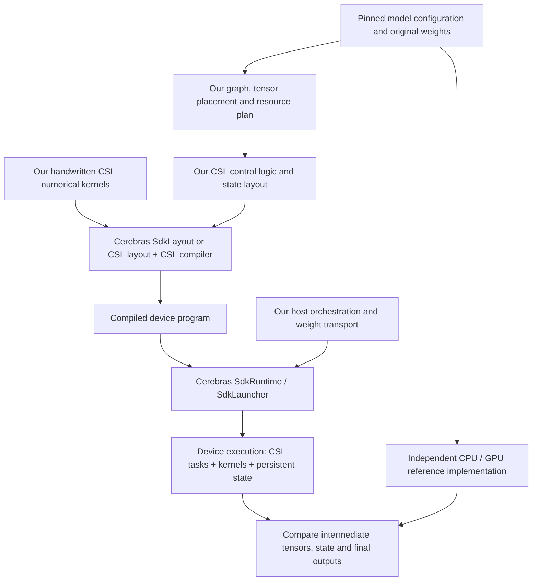

# CSL-LLM SDK

**Handwritten CSL inference for open language models on one to three Cerebras WSE-3 systems.** We are building the numerical kernels, execution schedules and persistent inference state, while reusing Cerebras tooling for layout, compilation, communication and program execution. The first target is text inference for **Qwen3.8-27B**; support for related model architectures is a longer-term goal.

**Current result:** real BF16 weight slices run in the SDK 2.10.1 simulator, including a two-PE projection → fabric transfer → sum → RMS normalization chain. Full-model text generation and physical one/two/three-system inference remain unvalidated. Completed experiments below are simulator results, not hardware performance measurements.

## 1. Project design



The device-execution box describes what the compiled program does; it is not an additional post-compilation assembly step. We define data dependencies, buffer ownership and completion events before compilation. The SDK executes those definitions; it does not automatically supply an LLM inference scheduler.

| Component | Responsibility |
|---|---|
| Our CSL kernels | Projections, normalization, attention, DeltaNet recurrence, FFN and vocabulary selection. Only the subsets logged below are qualified. |
| Our control logic and state | Order operations, join communication and compute completion, manage tile buffers, and eventually retain KV cache, recurrent state and token positions across calls. |
| Cerebras SDK | Layout/compiler, device task and communication primitives, host transfers, launches and supported appliance execution. |
| Independent reference | Establish expected numerical results. Current microexperiments use CPU references; official model/GPU references and applicable CS-Torch/Model Zoo tools are planned. |

The intended deployment paths are **single-wafer weight streaming** and **two/three-wafer pipeline parallelism**. Host-mediated stage transport is the initial cluster design; direct inter-wafer transport requires separate qualification. A quantized resident path is a separate experiment. Neither these deployment paths nor CS-Torch graph interoperability is established by the current microexperiments.

## 2. Completed development log — newest first

### WP02 · Two-PE execution chain · September 10, 2026

Two PEs split an original 128×112 BF16 weight tile into 56-column contractions. Handwritten CSL computes the partials, transfers one through on-wafer fabric, sums them and performs 128-element RMS normalization with unit gain.

- Four calls in one runtime passed independent checks of partials, sum, normalization, square sum, square root and reciprocal.
- Device event records verified both local-first and receive-first completion, with exactly one receive, commit and unblock per root invocation.
- Transferred partials were bit-exact; guards, weights, counters and exported handles remained valid. Execution stopped normally.

**Scope:** a reduced operator chain on two simulated PEs; not full hidden-size normalization or multi-wafer inference. [Report](docs/WP02-REPORT.md) · [Design and ownership](docs/WP02-DESIGN.md) · [Evidence](evidence/wp02.json) · [Example](examples/wp02)

### WP01 · Original-weight BF16 GEMV · September 10, 2026

A handwritten 128×112 GEMV uses lossless BF16-to-FP32 expansion and FP32 accumulation. Four calls in one runtime cover changed inputs, a last-column one-hot and zero after nonzero input. The largest absolute error was approximately 1.86×10⁻⁹, within the predeclared forward-error bound; state and guard checks passed.

**Scope:** one real-weight projection tile on one simulated PE. [Report](docs/WP01-REPORT.md) · [Evidence](evidence/wp01.json) · [Kernel](csl/kernels/local_gemv_bf16_f32_colmajor.csl) · [Example](examples/wp01)

### WP00 · Bounded execution and native bit transfer · September 10, 2026

Established resource admission, a single-heavy-job lock, bounded compilation/simulation and explicit host transfer codecs. A single simulated PE preserved seven BF16 bit patterns through native upload, device copy and readback, followed by normal shutdown.

**Scope:** transfer and execution foundations; no neural arithmetic. [Report](docs/WP00-REPORT.md) · [Evidence](evidence/wp00.json) · [Example](examples/wp00)

## 3. Repository guide

| Path | What to read or use |
|---|---|
| [`csl/kernels/`](csl/kernels) | Handwritten device arithmetic. |
| [`examples/`](examples) | Per-milestone CSL layouts, device programs and Python drivers. Start with WP01 for arithmetic or WP02 for composition. |
| [`core/qwen38/`](core/qwen38) | Host-side contracts, bit codecs, numerical reference/checking utilities and resource accounting. |
| [`tools/`](tools) | Bounded weight acquisition, reproducible run preparation, SDK container entry and guarded execution. |
| [`tests/`](tests) | Lightweight host checks; these do not substitute for SDK or hardware execution. |
| [`docs/`](docs) | Detailed experiment reports, design rationale, status and kernel provenance. |
| [`evidence/`](evidence) | Sanitized accepted-result summaries; raw model weights and private runtime artifacts are excluded. |
| [`PUBLIC_MANIFEST.json`](PUBLIC_MANIFEST.json) | Integrity inventory of the published files. |

## 4. Reproduce and follow development

Run the lightweight checks with Python 3.10+:

```sh
python3 -m unittest discover -s tests -v
```

For simulator experiments, follow the linked milestone reports and the
[development and reproduction guide](docs/DEVELOPMENT.md). They require a separately installed Cerebras SDK 2.10.1 and Singularity; the repository does not distribute the SDK or model checkpoints. Original-weight acquisition and synthetic fixtures are explicitly distinguished.

The guarded research harness runs one heavy job at a time with a 20 GiB RAM ceiling, zero task swap, an 8 GiB available-memory reserve and bounded deadlines/cache usage. These are local resource controls, not performance requirements for the eventual inference SDK. See the reports and runner implementation for exact limitations.

**Next:** full-5120 contraction with tiled weight loading and persistent accumulation, followed by remaining model kernels, reference qualification and complete-model integration. Work in progress is not listed above as completed. See [current status](docs/STATUS.md) and [milestone details](docs/MILESTONES.md).

MIT licensed; see [LICENSE](LICENSE). This is an independent research project, not an official Cerebras inference product.
