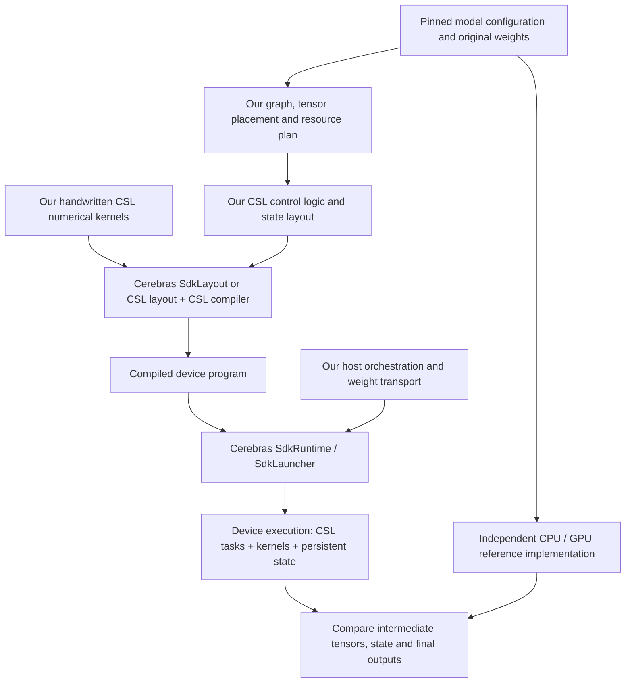

# CSL-LLM SDK

**Handwritten CSL inference for open language models on one to three Cerebras WSE-3 systems.** We are building the numerical kernels, execution schedules and persistent inference state, while reusing Cerebras tooling for layout, compilation, communication and program execution. The first target is text inference for **Qwen3.8-27B**; support for related model architectures is a longer-term goal.

**Current result:** real BF16 weight slices run in the SDK 2.10.1 simulator, including persistent accumulation across all 5120 input columns for 128 outputs and a two-PE projection → fabric transfer → sum → RMS normalization chain. Synthetic full5120 RMS with BF16 output and a full128×128 persistent DeltaNet head also pass their scoped checks. Full-model text generation and physical one/two/three-system inference remain unvalidated. Completed experiments below are simulator results, not hardware performance measurements.

## 1. Project design



The device-execution box describes what the compiled program does; it is not an additional post-compilation assembly step. We define data dependencies, buffer ownership and completion events before compilation. The SDK executes those definitions; it does not automatically supply an LLM inference scheduler.

| Component | Responsibility |
|---|---|
| Our CSL kernels | Projections, normalization, attention, DeltaNet recurrence, FFN and vocabulary selection. Only the subsets logged below are qualified. |
| Our control logic and state | Order operations, join communication and compute completion, manage tile buffers, and eventually retain KV cache, recurrent state and token positions across calls. |
| Cerebras SDK | Layout/compiler, device task and communication primitives, host transfers, launches and supported appliance execution. |
| Independent reference | Establish expected numerical results. Current microexperiments use CPU references; official model/GPU references and applicable CS-Torch/Model Zoo tools are planned. |

The intended deployment paths are **single-wafer weight streaming** and **two/three-wafer pipeline parallelism**. Host-mediated stage transport is the initial cluster design; direct inter-wafer transport requires separate qualification. A quantized resident path is a separate experiment. Neither these deployment paths nor CS-Torch graph interoperability is established by the current microexperiments.

## 2. Repository guide

| Path | What to read or use |
|---|---|
| [`csl/kernels/`](csl/kernels) | Handwritten device arithmetic. |
| [`examples/`](examples) | Per-milestone CSL layouts, device programs and Python drivers. Start with WP01 for arithmetic or WP02 for composition. |
| [`core/qwen38/`](core/qwen38) | Host-side contracts, bit codecs, numerical reference/checking utilities and resource accounting. |
| [`tools/`](tools) | Bounded weight acquisition, reproducible run preparation, SDK container entry and guarded execution. |
| [`tests/`](tests) | Lightweight host checks; these do not substitute for SDK or hardware execution. |
| [`docs/`](docs) | Detailed experiment reports, design rationale, status and kernel provenance. |
| [`evidence/`](evidence) | Sanitized accepted-result summaries; raw model weights and private runtime artifacts are excluded. |
| [`PUBLIC_MANIFEST.json`](PUBLIC_MANIFEST.json) | Integrity inventory of the published files. |

## 3. Completed development log — newest first

### WP06 · Full128×128 persistent DeltaNet head · September 10, 2026

Two simulated PEs retain a full FP32 recurrent state and compute decay, prediction reduction, delta distribution, state update and output reduction entirely in CSL. Four token updates across three request generations passed independent checks of every full state and intermediate vector.

- Continuous tokens preserve state; resets establish zero state before changed inputs. Packet identities, event order, guards and commit counters passed.
- Both compiled PEs fit48 KiB including a4 KiB stack allowance. Simulation completed normally in81.7 seconds with observed210 MB memory use.

**Scope:** one synthetic full-size recurrent head with normalized/scaled Q/K and explicit beta/decay inputs. [Report](docs/WP06-REPORT.md) · [Arithmetic and ownership](docs/WP06-DESIGN.md) · [Evidence](evidence/wp06.json) · [Example](examples/wp06)

### WP05 · RMS5120 with device BF16 rounding · September 10, 2026

One simulated PE computes full5120 ordinary RMS with offset gain `(1+w)`, observable FP32 intermediate results and actual BF16 round-to-nearest-even output. Four calls and16 signed rounding probes per call passed all independent numerical, state and guard checks.

- Shared gain/output storage reduces the payload to30 KiB; actual code/data plus a4 KiB stack allowance fits the48 KiB application budget.
- Simulation completed normally in57.1 seconds. The earlier candidate with an incorrect SRAM admission ceiling was stopped and explicitly excluded.

**Scope:** a synthetic full-dimension RMS operator, not a model layer or DeltaNet gated norm. [Report](docs/WP05-REPORT.md) · [Storage and error contract](docs/WP05-DESIGN.md) · [Evidence](evidence/wp05.json) · [Example](examples/wp05)

### WP04 · Pinned semantics and CPU references · September 10, 2026

Matched 851 text-backbone/head tensor metadata entries to the pinned candidate implementation and traced operator equations, precision boundaries and persistent state. Primary inference sources confirmed that DeltaNet swish gating and full-attention sigmoid gating belong to different branches.

- Twenty-seven small CPU checks passed using extracted, unchanged official function bodies and independent references: RMS5120, a128×128 recurrent head, causal attention24Q/4KV/head256, convolution and partial RoPE.
- The reference process completed in2.1 seconds under a2 GiB/60-second limit, without loading model weights or installing dependencies.

**Scope:** source/metadata audit and selected function-body execution; full Transformers runtime, checkpoint loading and whole-model numerical parity remain unvalidated. [Report](docs/WP04-REPORT.md) · [Equation and dtype contract](docs/WP04-SEMANTICS.md) · [Evidence](evidence/wp04.json) · [CPU fixtures](examples/wp04)

### WP03 · Persistent full-width contraction · September 10, 2026

One simulated PE accumulates an original BF16 128×5120 slab across 45 full tiles and an 80-column tail. Four calls in one runtime passed independent intermediate and final checks, including exact global-column-5119 one-hot and zero after nonzero.

- All 184 tile accumulations preserved the required generation and valid-column count; nonzero padding was excluded.
- Finalize-time guard snapshots, input/output guards and the final resident tile passed. Frozen source/input and compiled hashes remained unchanged.
- Simulation completed normally in 205.8 seconds under a 300-second deadline; observed simulator memory was approximately 213 MiB.

**Scope:** all input columns for 128 selected output rows, not all 17,408 output rows or a full layer/model. [Report](docs/WP03-REPORT.md) · [Design](docs/WP03-DESIGN.md) · [Evidence](evidence/wp03.json) · [Example](examples/wp03)

### WP02 · Two-PE execution chain · September 10, 2026

Two PEs split an original 128×112 BF16 weight tile into 56-column contractions. Handwritten CSL computes the partials, transfers one through on-wafer fabric, sums them and performs 128-element RMS normalization with unit gain.

- Four calls in one runtime passed independent checks of partials, sum, normalization, square sum, square root and reciprocal.
- Device event records verified both local-first and receive-first completion, with exactly one receive, commit and unblock per root invocation.
- Transferred partials were bit-exact; guards, weights, counters and exported handles remained valid. Execution stopped normally.

**Scope:** a reduced operator chain on two simulated PEs; not full hidden-size normalization or multi-wafer inference. [Report](docs/WP02-REPORT.md) · [Design and ownership](docs/WP02-DESIGN.md) · [Evidence](evidence/wp02.json) · [Example](examples/wp02)

### WP01 · Original-weight BF16 GEMV · September 10, 2026

A handwritten 128×112 GEMV uses lossless BF16-to-FP32 expansion and FP32 accumulation. Four calls in one runtime cover changed inputs, a last-column one-hot and zero after nonzero input. The largest absolute error was approximately 1.86×10⁻⁹, within the predeclared forward-error bound; state and guard checks passed.

**Scope:** one real-weight projection tile on one simulated PE. [Report](docs/WP01-REPORT.md) · [Evidence](evidence/wp01.json) · [Kernel](csl/kernels/local_gemv_bf16_f32_colmajor.csl) · [Example](examples/wp01)

### WP00 · Bounded execution and native bit transfer · September 10, 2026

Established resource admission, a single-heavy-job lock, bounded compilation/simulation and explicit host transfer codecs. A single simulated PE preserved seven BF16 bit patterns through native upload, device copy and readback, followed by normal shutdown.

**Scope:** transfer and execution foundations; no neural arithmetic. [Report](docs/WP00-REPORT.md) · [Evidence](evidence/wp00.json) · [Example](examples/wp00)

## 4. Reproduce and follow development

Run the lightweight checks with Python 3.10+:

```sh
python3 -m unittest discover -s tests -v
```

For simulator experiments, follow the linked milestone reports and the
[development and reproduction guide](docs/DEVELOPMENT.md). They require a separately installed Cerebras SDK 2.10.1 and Singularity; the repository does not distribute the SDK or model checkpoints. Original-weight acquisition and synthetic fixtures are explicitly distinguished.

The guarded research harness runs one heavy job at a time with a 20 GiB RAM ceiling, zero task swap, an 8 GiB available-memory reserve and bounded deadlines/cache usage. These are local resource controls, not performance requirements for the eventual inference SDK. See the reports and runner implementation for exact limitations.

**Next:**128-element direct-gain gated RMS with the correct early dtype cast and SiLU(z), then composition with the recurrent head, remaining model kernels and complete-model integration. Work in progress is not listed above as completed. See [current status](docs/STATUS.md) and [milestone details](docs/MILESTONES.md).

MIT licensed; see [LICENSE](LICENSE). This is an independent research project, not an official Cerebras inference product.
