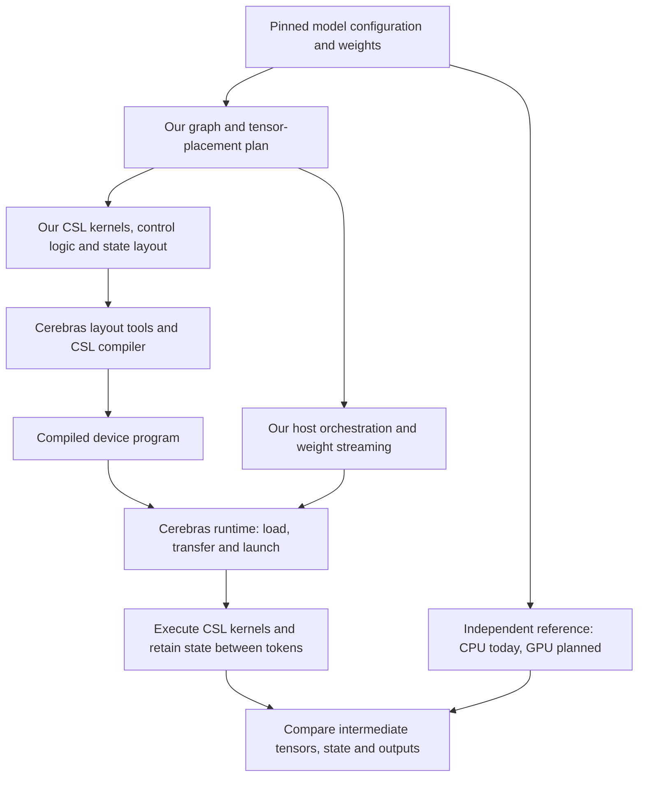

# CSL-LLM SDK

**Building inference for open language models with handwritten Cerebras Systems Language (CSL), targeting one to three WSE-3 systems.** We implement the numerical kernels, execution control and persistent model state, and use the Cerebras SDK to compile and run the device programs. The first target is **Qwen3.8-27B text inference**; the longer-term goal is a reusable SDK for related model architectures.

**Working today:** SDK 2.10.1 simulator experiments cover original-weight matrix–vector products, communication between processing elements, full-dimension normalization, a persistent DeltaNet recurrent head, its input/output processing, a full-dimension attention head with persistent KV cache, device-side query/key normalization with bounded rotary encoding, their on-device single-head attention composition, all selected-head Q/rawgate/K/V original-weight projections across eight bounded four-case runs, and a connected ten-PE path for two original-hidden tokens through all selected Q/rawgate/K/V projections, trained Q/K normalization/rotary encoding and attention with persistent KV, plus an original-weight four-PE partial MLP chain for one dense input. **Still ahead:** complete-model text generation and execution on physical single- or multiple-wafer systems. The completed log below records the exact scope of each result.

## 1. Project design

Qwen3.8 combines recurrent DeltaNet layers with full-attention layers. This requires two forms of state that survive between token calls: recurrent matrices and attention key/value (KV) caches. Our research focuses on mapping that computation, state and communication explicitly onto the wafer's processing elements (PEs).



The execution box is what the compiled program does. We write its scheduling, buffer ownership and completion rules before compilation; there is no separate step that assembles kernels after compilation.

| Part | What this project implements or reuses |
|---|---|
| **Our device code** | Matrix products, normalization, attention, recurrence and other model operations; task dependencies, communication and state updates. The completed log identifies the implemented subsets. |
| **Our host code** | Weight loading, execution schedules, tensor placement, resource limits and validation. General graph orchestration and cluster execution are still being developed. |
| **Cerebras tooling** | CSL layout/compiler, device tasks and communication primitives, host transfers and runtime launches. |
| **Reference computation** | CPU numerical references and selected functions extracted from a pinned official implementation. GPU reference execution and applicable CS-Torch / Model Zoo integration remain future work. |

The deployment design has two main paths:

| Target | Planned execution |
|---|---|
| **One WSE-3** | Stream weight tiles through reusable device buffers while retaining the required inference state. |
| **Two or three WSE-3 systems** | Partition layers into pipeline stages and transfer activations between systems. Start with host-mediated transport, then qualify direct inter-wafer communication separately. |

These are deployment targets; current simulator results do not establish cluster execution, hardware performance or a CS-Torch interface for inserting our CSL kernels into its compiled graphs.

## 2. Repository guide

| Path | Purpose |
|---|---|
| [`csl/kernels/`](csl/kernels) | Reusable handwritten CSL arithmetic kernels. |
| [`examples/`](examples) | Runnable experiments, grouped by milestone. Layout files place PEs and routes; device programs wire kernels and state; Python drivers load inputs, launch operations and collect results. |
| [`core/qwen38/`](core/qwen38) | Python numerical references, precision and communication contracts, data encodings and resource accounting. |
| [`tools/`](tools) | Small weight-slice downloads, experiment preparation, SDK container entry and resource-limited execution. |
| [`tests/`](tests) | Lightweight host tests for those utilities and contracts. |
| [`docs/`](docs) | Design explanations, experiment reports, model semantics and development status. |
| [`evidence/`](evidence) | Published result summaries that record what passed and under which conditions. |
| [`PUBLIC_MANIFEST.json`](PUBLIC_MANIFEST.json) | File hashes for checking the integrity of this published snapshot. |

**Suggested first read:** follow the two-PE example from its [layout](examples/wp02/layout.csl) to [device program](examples/wp02/pe.csl), [host driver](examples/wp02/driver.py), [report](docs/WP02-REPORT.md) and [result record](evidence/wp02.json). For the model equations and precision rules, read the [semantics contract](docs/WP04-SEMANTICS.md).

## 3. Completed development log — newest first

Each **WP** is a scoped development milestone. Device results below come from the SDK simulator; WP04 is a CPU/source audit. **BF16** means bfloat16 data, and **FP32** means 32-bit floating-point arithmetic. Reports contain numerical thresholds, failure history and reproduction details.

### WP16 partial · Original-weight four-PE MLP chain · September 10, 2026

Connected128 selected gate/up rows across all5,120 input columns to whole SiLU,
BF16 product and128 selected down rows over128 intermediate channels. One dense
input passed independent source, cast, transport, retention, release and shutdown
checks. The audit checked11,776 projection-prefix values and640 exact casts against
observed FP32 values. Simulation took285.33 seconds within a300-second limit;
peak observed memory was186.36MiB, a sampling lower bound. Middle weight tiles lack
complete bitwise readback, all observed joins were command-first, and reuse/reset
is not covered. This is a partial contribution; the full17,408-channel MLP remains open.

[Code and scope](examples/wp16/diagnostic) · [Report](docs/WP16-PARTIAL-MLP-REPORT.md) · [Evidence](evidence/wp16-partial.json) · [Source provenance](evidence/wp16-partial-source-map.json)

### WP15 · Original projections through persistent selected attention · September 10, 2026

Connected eight original-weight projection PEs to Q/K preprocessing and attention consumers. Two original 5,120-element module inputs produce Q256/rawgate256/K256/V256 at positions 0/1 in the same request and runtime; token 2 retains and consumes token 1 K/V. All source, actual-operand stage, exact cast, frame, cache, retained-weight and shutdown checks passed independent audit. All 2,048 projection, 1,024 Q/K and 512 final attention BF16 values match their official references. Simulation took 1,187.19 seconds with 267.37 MiB peak memory. The conservative token-2 source gate alone cannot reject uniform attention; actual Q/K dot checks independently reject that counterexample. Scope is one selected query/KV head and two tokens.

[Code and reproduction](examples/wp15) · [Protocol](docs/WP15-PROTOCOL.md) · [Report](docs/WP15-REPORT.md) · [Evidence](evidence/wp15.json)

### WP14 · Original hidden input through connected Q/K preprocessing · September 10, 2026

Connected four full-width projection PEs to a fifth PE for trained Q/K normalization and partial rotary encoding. One dense projection-input hidden vector spans all 5,120 columns, producing Q256/K256 and transferring them entirely on device at text position 1. Independent source, stage, cast, transport and retained-buffer checks passed, followed by normal shutdown in 256.01 seconds. All 512 projection and 512 final consumer BF16 values match their official references. This selected Q/K call does not yet include projected V/gate, attention or persistent KV.

[Code and reproduction](examples/wp14) · [Protocol](docs/WP14-PROTOCOL.md) · [Report](docs/WP14-REPORT.md) · [Evidence](evidence/wp14.json)

### WP13 · Original weights for all selected-head projections · September 10, 2026

Qualified layer3/head0 Q256, rawgate256, K256 and V256 over all 5,120 input columns. Eight independent single-PE runs each exercised four common inputs, including column 5,119 one-hot and zero after nonzero, covering all 1,024 selected rows. Independent source, prefix, rounding, state and shutdown checks passed for all 4,096 final outputs. This establishes complete selected-row coverage across separate runtimes; the connected two-token path is recorded in WP15.

[Code](examples/wp13) · [Design](docs/WP13-DESIGN.md) · [Report](docs/WP13-REPORT.md) · [Evidence](evidence/wp13.json)

### WP12 · Original Q/K through persistent attention on one PE · September 10, 2026

Connected Q/K normalization and device rotary encoding to attention with a persistent eight-slot KV cache. Original synthetic Q/K/V/gate inputs remain immutable; intermediate operands are copied on device. Ten tokens, overflow refusal before preprocessing, reset and normal shutdown passed. All 2,560 observed final BF16 values match the official reference. Conservative source intervals and strict stage checks qualify this bounded single-head fixture, not a complete model or general bitwise guarantee.

[Code](examples/wp12) · [Design](docs/WP12-DESIGN.md) · [Report](docs/WP12-REPORT.md) · [Evidence](evidence/wp12.json)

### WP11 · Query/key normalization and device rotary encoding · September 10, 2026

Implemented ordinary RMS normalization for a pair of 256-dimensional Q/K heads, then partial rotary encoding of their first 64 coordinates. Angles and sin/cos are computed in CSL for text positions 0–7. Ten calls matched all 5,120 official BF16 outputs, with separate product rounding, unchanged tails, reset and normal shutdown checks. Long-context positions and composition with attention remain separate work.

[Code](examples/wp11) · [Design](docs/WP11-DESIGN.md) · [Report](docs/WP11-REPORT.md) · [Evidence](evidence/wp11.json)

### WP10 · Attention head with persistent KV cache · September 10, 2026

Implemented 256-dimensional single-head attention with an eight-token BF16 KV cache and sigmoid output gating on one PE. Ten tokens matched all 2,560 official BF16 output values exactly; cache overflow rejection, reset, every intermediate stage and normal shutdown passed. Q/K inputs are already normalized and rotary transformed; those device stages and complete-layer integration follow separately.

[Code](examples/wp10) · [Design](docs/WP10-DESIGN.md) · [Report](docs/WP10-REPORT.md) · [Evidence](evidence/wp10.json)

### WP08 · Stateful input processing for a recurrent head · September 10, 2026

Implemented width-4 causal convolution, activation, query/key normalization and recurrence gates on one PE. Eight synthetic tokens, including a request reset, passed checks of the complete history and all intermediate results. This prepares one head's inputs; integration with the recurrent core is separate.

[Code](examples/wp08) · [Design](docs/WP08-DESIGN.md) · [Report](docs/WP08-REPORT.md) · [Evidence](evidence/wp08.json)

### WP07 · Recurrent output connected to gated normalization · September 10, 2026

Implemented gated normalization for a 128-element vector, then connected it to the recurrent core on a third PE. Four synthetic tokens across three request generations passed state, output and BF16 rounding checks. The device waits for the consumer's acknowledgment before reporting token completion.

[Code](examples/wp07_composed) · [Design](docs/WP07-DESIGN.md) · [Report](docs/WP07-REPORT.md) · [Evidence](evidence/wp07.json)

### WP06 · Persistent 128 × 128 DeltaNet recurrent state · September 10, 2026

Implemented a complete single-head recurrence across two PEs: decay, prediction, state update and output reduction. Four synthetic token updates across three request generations passed checks of every state element and intermediate vector. Inputs are already normalized; projections and a complete model layer are outside this milestone.

[Code](examples/wp06) · [Design](docs/WP06-DESIGN.md) · [Report](docs/WP06-REPORT.md) · [Evidence](evidence/wp06.json)

### WP05 · Full hidden-size normalization and BF16 output · September 10, 2026

Implemented RMS normalization for all 5,120 hidden elements, including the model's offset gain and device-side BF16 rounding. Four synthetic calls and dedicated rounding probes passed. Buffer reuse keeps compiled code/data and a 4 KiB stack allowance within the 48 KiB application memory budget per PE.

[Code](examples/wp05) · [Design](docs/WP05-DESIGN.md) · [Report](docs/WP05-REPORT.md) · [Evidence](evidence/wp05.json)

### WP04 · Model equations and independent CPU references · September 10, 2026

Matched 851 text-model tensor metadata entries to a pinned candidate implementation. Twenty-seven CPU checks exercised selected official function bodies for normalization, recurrence, attention, convolution and rotary position encoding. This establishes scoped reference behavior; a complete model checkpoint has not been loaded or executed.

[Code](examples/wp04) · [Semantics](docs/WP04-SEMANTICS.md) · [Report](docs/WP04-REPORT.md) · [Evidence](evidence/wp04.json)

### WP03 · Original-weight projection across all input columns · September 10, 2026

Streamed a BF16 weight slice with 128 output rows and all 5,120 input columns through 46 tiles on one PE, retaining the accumulation between tiles. Four calls passed intermediate and final checks, including the last input column and zero after nonzero input. This covers selected output rows, not a complete layer.

[Code](examples/wp03) · [Design](docs/WP03-DESIGN.md) · [Report](docs/WP03-REPORT.md) · [Evidence](evidence/wp03.json)

### WP02 · Projection, on-wafer communication and normalization · September 10, 2026

Split an original 128 × 112 weight tile across two PEs, transferred partial results through the wafer fabric, then summed and normalized them in CSL. Four calls passed numerical and state checks, including both compute-first and receive-first completion orders. This is a reduced operator chain within one simulated wafer.

[Code](examples/wp02) · [Design](docs/WP02-DESIGN.md) · [Report](docs/WP02-REPORT.md) · [Evidence](evidence/wp02.json)

### WP01 · First matrix–vector product with original model weights · September 10, 2026

Implemented a 128 × 112 matrix–vector product using original BF16 weights and FP32 accumulation. Four calls in one runtime passed numerical, buffer and state checks; the largest absolute error was approximately 1.86 × 10⁻⁹, within the predeclared bound. This is one projection tile on one PE.

[Code](examples/wp01) · [Kernel](csl/kernels/local_gemv_bf16_f32_colmajor.csl) · [Report](docs/WP01-REPORT.md) · [Evidence](evidence/wp01.json)

### WP00 · Bounded execution and exact bit transfer · September 10, 2026

Established resource limits, a single-heavy-job lock and host/device data encodings. Seven BF16 bit patterns survived upload, CSL device copy and readback exactly, followed by normal runtime shutdown. This validates the execution and transfer foundation before neural arithmetic.

[Code](examples/wp00) · [Report](docs/WP00-REPORT.md) · [Evidence](evidence/wp00.json)

## 4. Reproduce and follow development

Run the lightweight host checks with Python 3.10+:

```sh
python3 -m unittest discover -s tests -v
```

For simulator runs, follow the milestone reports and the [development guide](docs/DEVELOPMENT.md). A separately installed Cerebras SDK 2.10.1 and Singularity are required. The repository includes source and sanitized evidence; SDK distributions, model weight payloads and private runtime artifacts are excluded.

**In progress (WP16):** the full original layer-3 CPU reference and the one-input four-PE partial CSL chain are accepted within their recorded scopes. Connected reuse/reset, all17,408 intermediate channels and the full5,120 → 17,408 → 5,120 CSL MLP remain open. New CPU/SDK jobs require reviewed resource recipes. Integration of recurrent input processing, state updates and gated output has passed eight-token numerical checks, but final weight readback still fails; WP09 remains unaccepted. Complete-model integration and physical one-to-three-system trials follow. See [current status](docs/STATUS.md) and [milestone details](docs/MILESTONES.md).

MIT licensed; see [LICENSE](LICENSE). This is an independent research project, not an official Cerebras inference product.
