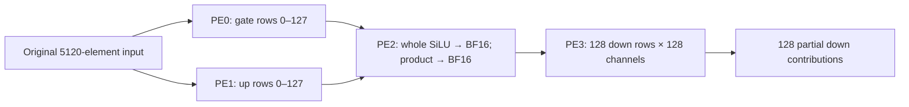

# Original-weight four-PE partial MLP milestone

The four-PE partial MLP chain is independently accepted for one dense input in the
Cerebras SDK2.10.1 WSE-3 simulator. It computes128 selected gate/up rows across all
5120 input columns, transfers the results to a whole-SiLU/product consumer, and
computes128 down-projection rows using only those128 intermediate channels.
The complete5120→17408→5120 MLP and whole-model inference remain unqualified.

Original BF16 weights come from the pinned model's layer3 MLP. Gate/up each use
46 persistent112-column tiles, with80 valid columns in the last tile. PE3 consumes
two64-column tiles from the device-received BF16 product. The host supplies original
weights, the hidden input and metadata; nonlinear and down operands are transferred
between PEs. The accepted GEMV, bounded exponential and whole-SiLU/product kernels
are unchanged from the reviewed source.

## What passed

The independent auditor checked all64 frozen source files,20 original compiled files,
three exact runtime-generated auxiliaries, and the actual four application ELF
layouts. The numerical/transport audit imported no candidate helpers, SDK or Torch.
It checked482 raw readback arrays,11776 cumulative projection-prefix values,
94 complete tile observation groups before weight overwrite,640 exact observed
FP32-to-BF16 casts,1152 independent conditional contractions, all transport frames,
29 retained buffers, release ordering and normal SDK shutdown.

Every projection tile retains exact input/padding, FP32 cumulative output, numeric
state and a device snapshot of weight guards before/after GEMV. These observations
must pass before the next weight overwrite; complete groups are saved before the
next H2D. All three data/ACK joins observed command arrival before data receipt.
The opposite device arrival order is not qualified by this run.

Full device weight-payload equality is checked only at the first/last projection
tiles, both down tiles and final retention: nine complete readbacks. Middle
projection tiles1–44 have host upload hashes, device boundary guards and source
interval checks, but no complete bitwise weight readback. Those separate checks
can miss corruption that cancels or remains inside a bound.

The640 exact cast checks compare each observed FP32 value with its BF16 rounding.
They are not official full-model bitwise parity. Partial-down bounds use only128
channels; a full17408-channel CPU down output is not used as a partial oracle.

## Execution and resource limits

| Measurement | Compile | Simulate |
|---|---:|---:|
| Unit elapsed seconds | 5.619419607 | 285.327341630 |
| Maximum observed/reported cgroup sample, bytes | 484392960 | 195411968 |
| Native task mask checks | 170 | 11229 |
| Actual memory maximum | 1GiB | 1GiB |
| Actual swap maximum | 0 | 0 |
| Eligible logical CPU / worker count | 0 / 1 | 0 / 1 |
| Task maximum / hard seconds | 128 / 300 | 128 / 300 |

Driver elapsed time was284.079242994 seconds. The run exceeded its240-second planning
estimate and finished inside the300-second hard limit without extension or retry.
Both owned units were independently found inactive/absent with PID0 and empty
cgroups. Observed memory-pressure/OOM/task-limit counters were zero. Memory samples
are lower bounds on lifetime peaks. CPU affinity is neither exclusive reservation
nor an enforced bandwidth quota.

Application ELF ordinary-section ends plus the declared4096-byte stack allowance
were44656/44656/18112/32960 bytes, each within49152. This is a static admission gate,
not a measured dynamic-stack peak. The completed candidate inventory was164 files /
5820316 bytes before the post-exit audit receipt, within its16MiB cap.

## Cost of the observations

The exact schedule completed846 operations:785 copies and61 launches;303H2D and
482D2H,5959676 host bytes and3061668 native bytes. There were1751 journal records.

| Blocking API class | Total seconds |
|---|---:|
| Weight D2H | 127.306510 |
| Other D2H | 142.256945 |
| All H2D | 0.023626 |
| Launch returns | 0.004968 |

These are API return durations and may include queued simulator computation.
Launch return time is not isolated kernel execution time; D2H time is not isolated
transport bandwidth. Final retention alone accounted for43.730 seconds. Six
57352-byte native16 weight readbacks took98.944 seconds; three32776-byte readbacks
took28.362 seconds. A456-byte FP32 input readback ranged from0.145 to2.517 seconds,
showing why call position and queued work matter as well as size/direction.

Diagnostic001 compiled but rejected SDK edge ELFs as application ELFs before any
simulation. Diagnostic002 corrected that classifier, then was stopped by the
controller after307.83 seconds because its per-tile full weight readbacks made the
budget infeasible. A subsequent two-case synthetic transfer comparison found only
a small difference between one and two eligible CPUs. Diagnostic003 reduced full
weight readbacks from97 to9 and added all-prefix checks plus explicit per-tile
guards. Earlier failures remain preserved; this acceptance does not retroactively
qualify them or resolve the separate WP09 shutdown issue.

## Evidence and reproducibility

Accepted candidate: `wp16-diagnostic-003`. Source manifest SHA256:
`1e7b26b77c78b55fe606e9f9f063c3d4f53a60603f10f72deacf011475020e33`.
Result SHA256: `9f91147a4e7efc5ae018f6128af3d24dd1d03af51f1916c818a056a43544f83b`.
Full raw journal SHA256:
`e514007b6e3a4d7b34f9791360196ff3334a257571540677549f1fe65fdaa5cb`.
The independent auditor checked original workstation archives directly.

Public evidence omits learned parameter payloads and SDK binaries. The filtered
observation export preserves473 nonparameter arrays /129572 raw bytes in57 archives,
with original-archive and completed-copy hashes; nine weight arrays remain private.
Source intervals and input-dependent outputs can be published with their exact
dtype, shape and payload hashes. Environment-specific execution paths and machine
identity are not transferable qualification; any public execution template must be
configured, frozen and resource-admitted separately on the target host.

Still open: changed-input and zero-after-nonzero reuse/reset, multi-generation
four-PE lifecycle, opposite device join order, full17408 intermediate-channel
streaming/down accumulation, full MLP output, recurrent-path WP09 shutdown,
whole-model generation, physical WSE and multi-wafer operation.
