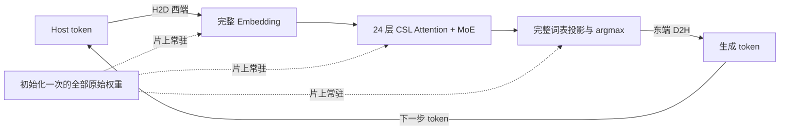

# GPT-OSS-20B 单 WSE-3 完整模型推理结果

2026-09-26，`full-model-hw-003` 完成真机验收：完整原始 GPT-OSS-20B
在单张 WSE-3 上连续运行两步自回归推理，生成 `Hello, World`。
全部权重在两步之间保持片上常驻，运行后逐项读回一致，设备正常退出。

这是完整模型的短输入功能验证。逐算子数值验收通过；与 CPU 基准逐层、逐元素
不超过 1 BF16 ULP 的严格比较没有通过，原始失败结果完整保留。

## 模型和实际执行

| 项目 | 实测或验证结果 |
|---|---|
| 真实模型 | `openai/gpt-oss-20b`，原始权重修订 `6cee5e81ee83917806bbde320786a8fb61efebee` |
| 完整性 | 459 个张量，13,761,264,768 字节原始载荷；全部文件通过发布方 SHA-256 校验 |
| 层与专家 | 全部 24 层，每层全部 32 个专家常驻；动态 top-4 路由 |
| 精度格式 | 原始 MXFP4 专家块和 E8M0 scales，其他权重 BF16 |
| 片上布局 | 750 × 1160，共 870,000 个应用 PE；2009 个共享程序 |
| SRAM 检查 | 最大普通段末地址 38,960 B，加 4096 B 栈预留，共 43,056 B；上限 48,128 B |
| 初始化 | 73,893 次有界传输，全部参数只加载一次 |
| 第一步 | 西端输入 13225 (`Hello`)，东端输出 11 (`,`) |
| 第二步 | 将实际输出 11 输入西端，东端输出 5922 (` World`)；沿用片上 KV |
| 前向时间 | 0.882838 s、0.895731 s，包含 host 控制提交和输出传输 |
| 保持与退出 | 全部参数读回一致；所有 PE epoch/交接检查通过；正常退出；所有作业已释放 |

SRAM 数字包含声明的栈预留，不代表测得了动态栈峰值。前向时间排除了模型加载、
诊断读取和权重读回；两次观测不构成稳定吞吐基准。

总体数据流保持西向东，局部区域使用南北方向的归约和收集：

Host 每步提交 1990 个固定 phase/layer/index 命令。Embedding、RMSNorm、
YaRN RoPE、带 learned sinks 的 GQA、KV 更新、32 路 router、top-4、
MXFP4 专家 GEMV、clamped interleaved SwiGLU、加权合并、残差和完整词表
选择均在 CSL 中执行。初始化之后输入的神经数据只有 token ID。
参考激活、专家结果和 logits 没有被传回设备参与计算。

## 数值验证与差异

验收规则在本轮结果产生前于 06:03 UTC 固定，文件哈希见
[`numerical-contract.json`](../evidence/full-model-hw-003/numerical-contract.json)。
物理运行结束后，使用各算子实际输入和原始模型参数独立复算。

| 检查 | 结果 |
|---|---|
| 层数 × 步数 | 48 / 48 全部通过 |
| 选中专家计算 | 192 / 192 全部通过 |
| 两类 RMSNorm | 对直接舍入的 FP64 基准，最大 1 BF16 ULP |
| 专家 gate/up 和 down | 1,658,880 个输出全部满足 FP32 累加误差界，越界值为 0 |
| SwiGLU | 552,960 个输出与原始 Torch 函数在相同输入下完全一致 |
| Router 与加权残差 | 矩阵误差界、实际 logits 的 top-4 顺序、softmax、合并均通过 |
| Attention | 相同实际输入下，最大局部 residual-update 相对 L2 误差 0.01334%；最大输出相对 L2 误差 0.00520% |
| 完整词表 head | 在实际末层状态上复算，两个 greedy token 均与真机和原始参考一致 |

严格的全链 CPU 逐层比较仍失败：两步末层输出相对 L2 差异分别为 0.9225%
和 1.2884%。BF16 舍入会逐层传播，动态专家选择也会放大差异。第一步第 10 层
的专家 7 和 30 存在完全相同的 BF16 路由分数；本实现按较小 ID 优先选择。
PyTorch 不保证 `topk` 对同分元素采用稳定索引顺序，见
[官方说明](https://docs.pytorch.org/docs/2.14/generated/torch.topk.html)。
验收同时检查完整 32 路 logits 和明确的同分规则，不把非同分的错误选择当作例外。

完整指标见 [`qualification-summary.json`](../evidence/full-model-hw-003/qualification-summary.json)，
逐层结果见 [`QUALIFICATION.json`](../evidence/full-model-hw-003/QUALIFICATION.json)。
旧严格比较保留在 [`observations.json`](../evidence/full-model-hw-003/observations.json)，
没有改写成通过。

## 验收记录和边界

- 编译作业：`wsjob-pyuzimpkuxchzpwjpf2kb2`，成功并释放。
- 真机作业：`wsjob-gwfpx94zw3bsivg6svrzw5`，06:16:49–06:30:02 UTC，成功并释放。
- 离线核验：两 CPU 线程、4 GiB 服务内存限制，96.7 秒完成，服务已退出。
- 最终验收：06:33:29 UTC，见 [`COMPLETE.json`](../evidence/full-model-hw-003/COMPLETE.json)。

当前 KV 容量为 96 token，本轮实际验证的是 batch=1、单 token 提示、连续生成
两个 token。尚未验证长上下文、多提示集质量、长文本生成或稳定性能。
当前可复现实验入口使用固定 `Hello` 输入；它是完整模型功能验证程序，尚非通用服务接口。

模型载荷、NPZ、ELF 和编译归档保留在 workstation/ALCF；本地项目只保存源码和
紧凑证据。开发过程保留了之前的失败、部分模拟器结果及其边界。
详见[实现设计](FULL-MODEL-BACKEND-DESIGN.md)、[重跑步骤](REPRODUCING-FULL-INFERENCE.md)
和[完整状态记录](../STATUS.md)。
