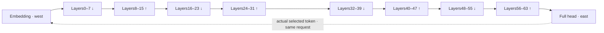

# Resident west-to-east layer pipeline

The user's current target is defined in [USER-SPATIAL-PIPELINE-TARGET.md](USER-SPATIAL-PIPELINE-TARGET.md).
All64 original layers occupy disjoint resident stages. The primary goal is >=2000
completed generated output tokens/s in aggregate during sustained steady state,
with each request obeying its full autoregressive dependency. The old batch-one
500us/token and7.81us/layer constraints are superseded. No measured model rate is
claimed. The original functional capture and its failed strict comparisons remain
unchanged.

## Concrete P22 map

`spatial/pipeline.py` imports all1172 original operations and1251 original tensors.
The750x1160 application rectangle contains868500 data PEs and a reserved two-row,
1500-PE westbound feedback corridor. A63x1158 embedding stage occupies the west;
a63x1158 final norm/full248320-row head stage occupies the east. Between them are
eight78-wide macro columns, each containing eight distinct layer stages. Model
order proceeds south in one column, north in the next, then east to the next
column. This is macro west-to-east flow with genuine2D stages, not64 thin equal
strips or time overlay of64 layers on shared whole-wafer compute coordinates.

GDN stages have78x146 PEs; attention stages have78x141 PEs. Their internal mix,
gate/up and down rectangles use a capacity-checked T partition, with shared
physical boundaries. For layer0 these are45x79,78x67 and33x79 respectively. Areas
come from exact banks/state/values, not equal thirds. The matrix-MAC/PE proxy only
breaks allocation ties; true service-time balance is **not measured**. Layer-local
operator/time reuse is allowed. Other layers cannot borrow these resident banks
as an excuse to restore the old overlay architecture.

The initial old2-row BF16 storage granularity unnecessarily wasted the tail of
large embedding/head banks. The new address generator uses original1x128 BF16
rows (paired execution is possible when both are local), retaining2x128 FP8 tiles
and exact FP32 expansions of their original BF16 scales. This lossless ownership
change is audited; its composed executable remains unqualified. No weight is
re-quantized or streamed from the host between layers.

## P23 native-loop lowering within the same rectangles

`spatial/layer_schedule.py` supersedes P22's cyclic matrix addresses with fixed-K
native row-loop ownership. Full stage rectangles and original tensor identities
remain unchanged. Gate/up now use paired8x32 contractions and down4x64; BF16
retains1x128 rows. The full194-region address census passes, and original layer0/1
packing samples match the publisher-verified checkpoint. GDN state uses4x8 FP32
pages so it fits actual small bank tails without assuming a4KiB contiguous gap.

The actual fused actor consumes packed complete-K gate/up BF16 pairs and performs
SiLU/multiply, group128 quantization and native down packet slicing. Selected
actors have16640bytes of original payload; heavy roots retain only projection
rounding. One unused stage PE owns the stage request lease. Six selected profiles
compile at maximum47712bytes including4096 stack, leaving416bytes. This does not
include complete fabric or neural-layer execution. Current exact sources and
evidence are described in [RESIDENT-LAYER-BACKEND.md](RESIDENT-LAYER-BACKEND.md).

## P24 reduction network and fused block transfer

The MLP producer now has an arrival-driven CSL native row loop and complete-K
tree reduction. Balanced inorder roots stay inside the existing weight-owner
groups. The full-model reduction audit covers499568 edges and2122720 PE/color
entries, with no alias among those tree paths. Sliced ingress, root-to-fusion and
external credit paths remain open; this is not the whole layer fabric.

Initial operands, decoded weights, consumed child packets and outgoing results
reuse one512-byte arena in explicitly separated phases. One ordered child DMA
preserves local-left-right addition and frees DSR5/UT4. A producer advances only
after both its send callback and the real consumer credit. The fused receiver
credits each copied8-row projection block immediately, preventing a stop-and-wait
cycle while it gathers its128-value quantization group. The receipt buffer itself
is held through its send callback.

Selected network compile007 admits16 maximum-actual-payload body profiles at
47936bytes including4096 stack. Fusion backend009 also compiles. Complete-instance
SRAM, the combined native/fusion communication leases and changed arithmetic
remain unqualified. See [LAYER-PROJECTION-NETWORK.md](LAYER-PROJECTION-NETWORK.md).

## P25 static cross-kernel copy transport

P25 supersedes P23's round-robin fusion scratch assignment and P24's per-block
software-credit requirement for the new gate/up copy path. It preserves weight
and auxiliary addresses and the original arithmetic tree. Seven-color interval
trees plus congestion-aware fixed-color paths connect both complete gate/up
geometries; every actual PE/ELF is admitted at maximum47712bytes including stack.
The64-layer metadata audit checks4032 projection streams, while full-region
compiler012/013 cover5226/5264 PEs. Input/down paths and neural execution remain
open. The earlier color-swap candidate is rejected by actual WSE-3 compilation.

Private sender memory is reusable once its packet is copied into a permanently
bound FIFO output queue. Hardware backpressure limits outstanding traffic.
This grants no stage/request completion. A separate256-byte early suffix buffer
allows independently arriving neighboring projection roots to progress without
waiting for the receiver's earlier quantization groups. Main/suffix DMA leases
compose with the actor's native computation; final request/state drain and actual
downstream distribution are the next integration gates. See
[LAYER-FUSED-TRANSPORT.md](LAYER-FUSED-TRANSPORT.md).

## Explicit resource limits

P22 gave every region exact cyclic matrix slots and a prefix allocation of128-byte
auxiliary pages. `local_tile_owner` and `auxiliary_owner` return a PE and local
byte offset for original weights, values and disjoint request states. All1251
tensors are covered once; all1172 operations are bound once. Conservative value
reservation retains every distinct region input/output in both work slots before
any lifetime optimization. Mutable request states never alias these two slots.

The candidate reserves35256B payload,7424B code/SDK,4096B stack and1352B
communication scratch per data PE, totaling48128B. These are **planning
allowances**, not a complete compiled role census. The old selected MLP compile does not
admit these new layer/state/scheduler programs. Per-role compiled ELF plus stack,
physical routes and executable schedule are mandatory next gates.

Original text weights occupy29468003328B. With scale replication, auxiliary page
rounding, conservative live values and two independent request states, allocated
payload is30213126400B. Each context96 request adds160235520B:150994944B GDN,
2949120B convolution history,6291456B KV. This candidate admits concurrency2;
concurrency3 requires753 columns and is rejected. The capacity sweep is a result
for this packing and code budget, not a global impossibility proof. State growth,
code footprint, scale replication and rectangle waste are explicit optimization
terms. Do not assume64 resident layers imply64 resident independent requests.

## Fusion is ownership and direct consumption

`spatial/pipeline_lowering.py` emits66 layer-local kernel bindings,65 adjacent
stage interfaces, and real semantic cross-region streams. Each model layer has
three fusion contracts:

- Residual -> RMS -> group128 quantization -> gate/up shared operand fork. Retain
  the residual for the down add. RMS still requires the complete5120-value sum;
  each quantizer still requires its original128-value maximum.
- Complete-K gate/up BF16 rows -> BF16 SiLU -> BF16 multiply -> group128 max,
  scale and native down packet. Consume actual producer outputs and preserve
  each specified BF16 rounding. Avoid a centralized17408-value gather.
- Complete-K down sum -> BF16 -> retained residual add -> BF16 successor chunks.
  Each chunk waits for all136 original K blocks. The next layer can accumulate
  local RMS squares as chunks arrive but cannot finalize RMS before the vector.

Reuse `csl/mlp_fused.csl`, the original `../csl/qwen_math.csl`, qualified native
FP8/BF16 arithmetic and credited joins. The existing whole-wafer worker and
activation bodies are source references; importing them does not requalify their
coordinates, scheduler or changed reduction order in these smaller stages.

## Streams, queues and request epochs

Each adjacent-stage boundary has40 one-hop lane pairs. BF16 activations use40
chunks of128 elements:64 payload words plus request ID, request generation,
position, lease ID and chunk index. Two slots per lane are a bounded interface
contract. Direct internal region boundaries have as many lanes as fit their
shared edge; groups reuse them with credits. No host neural intermediates are
part of the contract. The9944 generated one-hop port pairs are audited for
adjacency and uniqueness within an interface.

**Boundary ports are not complete fabric routes.** Producer-owner to boundary,
boundary to consumer-owner, region-internal multicast/reduction, and global
feedback still need lowering and simultaneous color/queue/DSR/thread admission.
IR flags remain false for those gates. Do not infer all-route legality or deadlock
freedom from a one-hop interface audit. Logical eastern output is not evidence of
a physical east-side host port; the actual SDK endpoint mapping must be checked.

`spatial/pipeline_protocol.py` provides an adversarial protocol oracle.
`csl/pipeline_lease.csl` is the layer-slot guard compiled in P23's selected
stage-controller role; its full fabric integration remains unqualified. It
requires complete operand masks and once-only state commit, separates
local send completion from remote consumption credit, and refuses slot reuse
until both arrive. Request generations and monotonically changing leases reject
stale warm-run traffic. Actual callbacks and distributed acknowledgements must
supply these events; the guard does not create them. Warm reset needs drained
routes/slots, actual state clearing and acknowledgements from all66 stages.

The feedback oracle checks actual selected token IDs: after fixed prompt tokens,
only the prior full-model selected token can enter the next position of that
request. Independent requests may overlap. A single request cannot fill later
pipeline positions speculatively. With concurrencyC, achieving2000tokens/s requires
mean request feedback cycles <=C/2000 seconds in steady decode (a necessary
condition, not a measured rate or a per-request500us requirement).

## Lowering and next acceptance boundary

1. Pinned model/precision/state semantics.
2. Disjoint layer and operator regions with exact bank/page ownership.
3. Fused producer/consumer chunks, request epochs and buffer completion edges.
4. Simultaneous fabric routes and PE queue/DSR/thread/code/stack leases.
5. Compiled CSL, original-weight numerical execution, physical service times.

The first three have a concrete candidate; step4 and complete step5 remain open.
Next compose the real layer0 -> layer1 path on these coordinates, including GDN,
MLP, both requests and actual next-layer consumption. Use that connected path to
validate/optimize the generator, then instantiate all64 stages and full feedback.
Do not revert to an unbounded isolated matrix or helper benchmark series.

The old overlay architecture is preserved in
[HISTORICAL-ARCHITECTURE-P21.md](HISTORICAL-ARCHITECTURE-P21.md).
Its evidence and useful modules survive; it is not the current final architecture.
