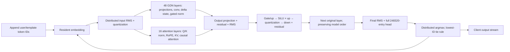

# Selected complete-model dialogue architecture

September 28, 2026, P50 design decision. Implement the **variable-width,
7/9-layer macro partition** in `evidence/dialogue-architecture-001`, with
distributed fusion and a separately lowered physical network. This replaces
continuation of the fixed P22–P49 coordinates as the development plan. The old
implementation and its original numerical/compiler evidence remain the baseline.
The overall goal is active and unmet. Selection is permission to implement a
testable design, not a statement of compiled SRAM, numerical acceptance or TPS.

The workload is one continuing conversation: append user text, generate a
dependent reply, retain all history/state and repeat. Acceptance remains
`sum(assistant content tokens) / sum(complete response durations) >= 2000/s`.
Appended prompt processing, TTFT, decode, output and required synchronization
are included. Initial loading and human think time are excluded and reported
separately. No independent-request concurrency multiplier is permitted.

## Why this candidate

The comparison regenerated the complete 1,251-tensor, 1,172-operation model and
changed physical ownership. Native contraction granularity is part of capacity
planning; the first cyclic-only 4- and 16-column attempts could not lower their
native banks and are retained as rejected candidates. Reflection of each layer's
operator regions is chosen from its actual entry and exit faces. Boundary lanes
are selected using complete source-root to destination-page paths.

The following counts cover all **63 layer-to-layer handoffs**, including both
interior paths. They exclude other traffic and are geometric counts, not time.
All color traffic uses the same physical-link load counter.

| Candidate, context96 | Mean word distance | Longest path, hops | Busiest directed link, words/pass | Sum of per-edge maximum hops | Required packing width |
|---|---:|---:|---:|---:|---:|
| Uniform 8-column, fixed lanes, screen005 | 193.12 | 358 | 3,005 | 15,720 | 742 |
| 4-column, native banks, aligned flow/lanes, screen009 | 103.97 | 219 | 2,857 | 10,205 | 750 |
| **Variable 8-column, native banks, aligned flow/lanes, screen010** | **106.60** | **248** | **1,776** | **9,402** | **746** |
| 16-column, native banks, aligned flow/lanes, screen011 | 148.33 | 300 | 3,005 | 14,936 | 750 |

Select the variable 8-column candidate: its handoff volume-distance is close to
the 4-column candidate, with less concentrated link load, a smaller summed
serial-edge geometry and more attention-state capacity. The 4-column candidate
is retained as a fallback if measured stage latency favors its shorter individual
paths. The 16-column candidate offers no advantage in this screen. This does not
establish whole-network congestion or a performance winner on hardware.

The selected plan then reserves **512 positions**, moving no matrix weights.
KV growth changes actual input-page destinations, so its handoff paths were
recomputed: 5,544 packets, 189,000 words, 20,583,277 word-hops, 108.91 mean
distance, 248 maximum hops and 2,368 maximum directed-link words. This explicit
tradeoff supports useful multi-turn development; 512-position inference itself
is not yet qualified. At context96 the unchanged-region byte ceiling was816;
that ceiling is not a supported runtime limit. Larger context needs a new
allocation and timing qualification, never silent truncation or state reset.

## Reproducible physical map and memory

`selected-plan.json` contains every stage and region rectangle, all matrix tile
descriptors, all state/value pages and 66 planned controller coordinates. Use
`spatial.layer_schedule.tile_owner`, `auxiliary_owner` and `rank_xy` for exact
addresses. No old route or PE owner is a constraint on new lowering.

The application is750x1160. Rows1158–1159 reserve feedback/control space.
The [generated PE map](DIALOGUE-PE-MAP.svg) displays these exact region coordinates
and the planned controller locations.
Embedding occupies x0–62, head x687–749, both y0–1157. Layer macro partitions are:

| Layers | x start | Width | Layer order in y |
|---|---:|---:|---|
| 0–6 | 63 | 72 | south |
| 7–15 | 135 | 87 | north |
| 16–22 | 222 | 68 | south |
| 23–31 | 290 | 87 | north |
| 32–38 | 377 | 68 | south |
| 39–47 | 445 | 87 | north |
| 48–54 | 532 | 68 | south |
| 55–63 | 600 | 87 | north |

This is a newly generated candidate with unequal areas and internal reflections;
the shape and ownership remain tunable. GDN and attention have distinct shapes.
For example layer0 is72x166 with mix72x50, gate/up48x116 and down24x116.
Layer3 is72x162 with mix72x46 and the same MLP dimensions. Later macro partitions
use87- or68-wide stages; their exact rectangles are in the plan.

The exhaustive bank audit covers194 regions,498 matrices and115,077,120 native
tiles. Original text weights remain29,468,003,328 bytes. Persistent state is
187,498,496 bytes for one conversation at512 positions: unchanged FP32 GDN and
convolution state plus expanded BF16 KV. Total planned payload is30,080,153,856
bytes. Two temporary work slots remain distinct from persistent state.

| Ordinary PE planning allowance | Bytes |
|---|---:|
| Matrix/state/value payload ceiling | 35,256 |
| Code and SDK | 7,424 |
| Stack | 4,096 |
| Transport scratch | 1,352 |
| Application address ceiling | 48,128 |

Maximum actual planned payload is35,228 bytes; the nominal smallest margin is
28 bytes. **This is a planning reservation, not executable headroom.** Every
generated role must pass actual ELF+stack admission before numerical execution.
New arithmetic/fusion code that exceeds its allowance triggers local bank/role
rebalancing; it cannot borrow a presumed whole-wafer memory pool.

There are42 dedicated planned controllers and24 controllers on light native
cohosts, excluding existing quantization actors. Each reserves an additional
3,072 bytes for controller code/state; the smallest planned cohost margin is
15,284 bytes. This solves the coordinate/byte reservation, not asynchronous
cohost lease composition. `selection.json` lists every controller and every
region's maximum payload, spare pages and unqualified compiled-SRAM status.

## Full graph and spatial fusion

The GDN/attention boxes describe two layer types, not parallel alternative
models. The original graph fixes48 GDN layers and16 attention layers, with an
attention layer at each fourth position. All64 layers are resident and ordered.

* **Projection/MLP:** retain packed original FP8 and exact original scales.
  Gate/up share K-slice input ownership. Local partials reduce in a declared
  numerical order; complete-K rows round to BF16. The owner of each128-value
  activation group directly consumes gate/up rows, performs the original BF16
  SiLU/multiply and quantization, then feeds down owners. Keep the early suffix
  buffer at output-group boundaries. Down roots add the retained residual and
  send distributed rows to the next layer's actual input owners. There is no
  central per-row grant or host intermediate in the intended serving path.
* **Normalization:** input-page owners accumulate local squares while data
  arrives; a bounded tree reduces and broadcasts the scalar inverse RMS. The
  global dependency remains: normalization cannot finalize before all5120
  values. Chunk quantization waits for its original128-value maximum. Replicate
  scalars and input slices through bounded local trees, not whole vectors at a
  single gather PE. The three nonadjacent internal streams in this selected
  partition require explicit paths; they are recorded, not treated as one hop.
* **GDN:** the next lowering groups state by head and value columns near its
  Q/K/V consumers. A concrete initial shard is128 keys x4 values,2KiB FP32;
  32 shards/head and48 heads give1,536 state shards per layer. Plan all state
  addresses before assigning colors. Original4x8 pages are the current exact
  storage map; regrouping to these compute shards needs a complete remap/bank
  audit and numerical requalification. Per-head Q/K normalization, recurrent
  update and gated-RMS scalar trees keep outputs distributed. Do not insert a
  long global return chain simply to retain historical colors. Full-key local
  dot order and original BF16 boundaries remain explicit.
* **Attention:**24 query heads share4 KV heads,256 dimensions. Preserve the
  per-head query/gate split, Q/K normalization, partial RoPE and absolute
  position. Shard KV by KV head and history block within the attention region;
  append only the new position. Use local QK partials, a declared softmax
  reduction, then distributed value products and the original gate. Scores,
  scale, softmax and value rounding retain the graph's specified BF16 points;
  changing reduction order requires the existing strict reference gates.
* **Embedding/head:** broadcast the selected token ID to resident embedding
  owners and return only that row. Final normalization feeds all vocabulary
  partitions. Local winning value/ID pairs reduce to one global winner with
  lowest-ID ties. Keep248,320 logits on chip during normal generation. Feedback
  is a small epoch/position/token packet through a reserved corridor, separate
  from client output acknowledgement.

All persistent GDN, convolution and KV state survives a completed reply. Track
emitted/selected tokens separately from committed-through-layer64 positions.
Commit a final selected token exactly once before appending a new prompt when
required. Reset drains local sends, remote consumption and state updates before
advancing the conversation generation. These rules reuse the dialogue protocol;
the current selected map does not yet implement the serving controller.

## Lowering and resource contracts

Use four explicit levels: original typed operations/rounding; logical tensor
shards and lifetime/fusion boundaries; physical region/owner/path maps; CSL
queues, colors, DSRs, tasks and compiled memory. Preserve manual knobs for shard
size, region area, reflection, reduction root, fanout tree, chunk lane, buffer
depth and task lease. A physical move must not rewrite model arithmetic.

The path generator must emit the whole producer→consumer route, word counts and
completion/credit dependency for every edge. Merge loads by directed physical
link regardless of color. Admit a single RX direction per PE/color, explicit
queue capacity and an acyclic wait-for/phase graph. Where a phase reuses a route,
require both local callback and actual output-queue drain before changing it.
Data arrival triggers ready tasks; a send callback only releases local transport
storage. Consumer credit and persistent-state commit remain separate events.

SDK2.10.1 default memcpy ownership conservatively reserves DSR index0 and
queues/microthreads0–1, as documented in `spatial/sdk_leases.py`. Initial native
role leases reuse qualified IQ2 ingress, IQ3/4 reduction, DSR4 arithmetic and
DSR6/UT5 output patterns where their lifetimes compose. IQ6/7 fusion buffers and
IQ5 control cannot be assigned twice on the same cohost. The generated allocator
must reject overlap, and explicitly bind control markers to their data queue.
The experimental stream bridge's UT1 use is not a serving lease qualification.
No global numeric color assignment is frozen before the new routes are lowered.

The complete wire graph is an implementation gate. The current path report
covers down-root to next input-page handoffs only; residual colocation, subsequent
fanout, GDN/attention collectives, full head and feedback are still missing from
the physical congestion report. A smaller reported maximum is not a claim that
the unreported links are empty.

## Performance and I/O decision gates

Single-conversation decode needs mean full dependent feedback<=500us. Complete
response timing is stricter because new-input/prefill and TTFT consume budget.
Use a max-plus dependency model with measured producer readiness, compute,
transfer, state commit and head/feedback events. Summing all traffic is not a
latency model; using only the slowest stage is a multi-request capacity model.

Current qualified primitive reuse gives a strong warning: selected-shape MLP
work alone sums to5,054,817.625 cycles using the maximum region per layer, or
9,930,163.65625 cycles with gate/up and down serialized. This is a conditional
reuse screen, not a fundamental hardware lower bound or measured layer latency.
At2000/s the first figure would require10.10963525GHz before any other costs.
No such device frequency is assumed. **Routing-only improvements cannot justify
the target with the existing primitive schedule.** The implementation must
amortize descriptors/control across long row loops, vectorize exact FP8 decode,
and overlap bounded decode scratch with native arithmetic; full BF16 weight
expansion is outside the resident capacity. Recalibrate the changed kernel,
then use marginal full-path benefit to redistribute PEs. Do not add PEs merely
because a matrix has more MACs.

Initial original weight upload is29,468,003,328 bytes before transport framing.
For resident decode,32-bit output IDs alone are8,000 bytes/s at the target;
BF16 full logits would be993,280,000 bytes/s. Select tokens on chip and batch
output transport without holding up dependent feedback. Appended prompts use
token IDs and explicit epoch/position boundaries; host tokenization/template
time belongs in response timing. Prefill consumes the real suffix in order and
may pipeline different known positions with state/causality fences. Future
GEMM-style prompt batching must preserve that order and be measured separately.

The deployed SDK's physical endpoint/channel mapping and small-message latency
are **unmeasured**. Logical west/east is not a verified host port. Existing
one-channel memcpy tests prove their tested API path only. Before selecting a
host transport configuration, inspect the installed SDK mapping and run one
bounded on-device-control versus per-token-host-control discriminator. Report
clock provenance, message size, outstanding depth and full client timing.

## Implementation sequence and acceptance

1. Keep this chosen map and comparison reviewable. Implement logical ownership,
   GDN head-local/state remap and complete multicast/reduction/handoff paths;
   audit every byte, link and resource lease. Generate a compiled role census
   only after those whole-model contracts are consistent.
2. Resolve the decisive compute unknown with the smallest exact-original FP8
   row-loop comparison: does vector decode/overlap reduce the selected workload's
   service floor enough without exceeding its declared bank/scratch budget?
   This is an architecture discriminator, not another old-coordinate bridge.
3. Qualify adjacent complete layers2→3 and3→4 (GDN→attention→GDN), then6→7 across
   a macro boundary. Use original weights, persistent state, actual next-layer
   consumption, local drain and independent numerical checks. Compile both
   controller roles and the true worst storage profiles. Test context growth
   and backpressure, with a watchdog and resource release receipts.
4. Expand to all64 only after those representative paths pass. Connect full head,
   feedback and the host suffix/output contract. Measure at least three dependent
   dialogue turns under `DIALOGUE-ACCEPTANCE.md`, then longer declared histories.
   Publish each evidenced milestone; keep failures and the old functional result.

The in-flight stream work was closed before this decision. Single-domain sim013
and014 pass four continuing invocations each with independent capture audits.
Dual-domain015 failed layout ordering,016 exceeded SRAM by16 bytes, and017 passed
SRAM but hit a simulator fatal error and timed out. No dual-domain correctness
or speed claim is made; no further old-coordinate bridge sequence is scheduled.
All eight P50 workstation services are released; no new WSE job was submitted.

## Related work and comparison scope

WaferLLM's2D MeshGEMV and bounded K-tree reductions motivate local, parallel
collectives and explicit physical mapping. Its WSE-2/model/context experiments
are not this Qwen3.8/WSE-3 multi-turn acceptance result. Compare complete workload
and timing boundaries before claiming a speed advantage.
[WaferLLM, OSDI2025](https://www.usenix.org/system/files/osdi25-he.pdf).

SpaDA's explicit placement, asynchronous dataflow semantics and multi-level CSL
lowering motivate the logical-to-physical split and resource/lifetime checks.
Its reported kernels are not evidence for this model's TPS.
[SpaDA, revised April2026](https://arxiv.org/abs/2511.09447).
